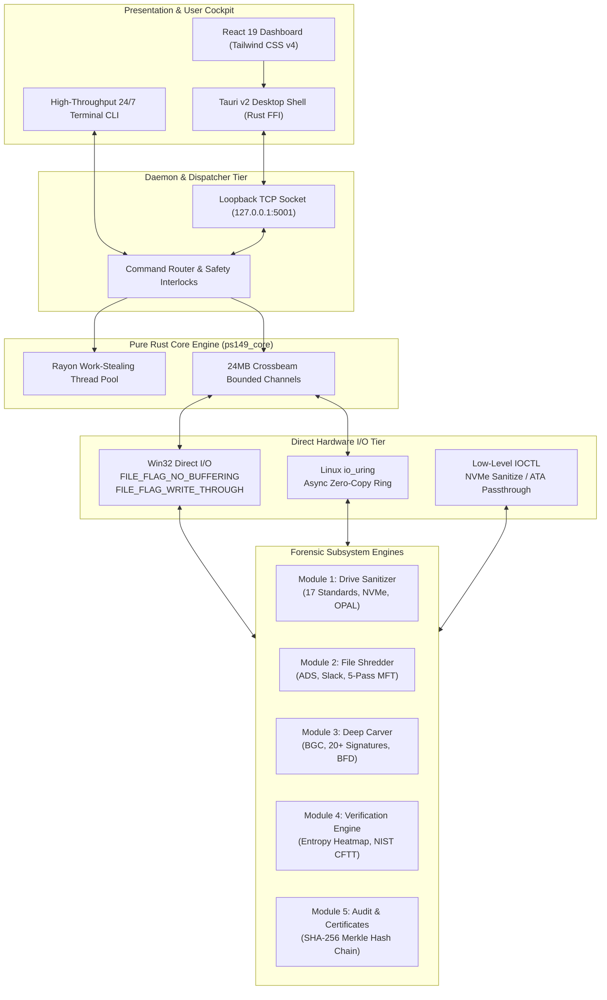

<p align="center">
  
  
  
  
</p>

<h1 align="center">🛡️ VOID VAULT</h1>
<h3 align="center">Integrated Secure Data Erasure & Advanced Forensic File Recovery Platform</h3>

<p align="center">
  <b>100% Memory-Safe Pure Rust • Air-Gapped Standalone • Self-Adversarial Closed Loop • BSA 2023 §63 Certified</b>
</p>

<p align="center">
  <a href="#-architecture-blueprint"></a>
  <a href="#-desktop-workstation-cockpit"></a>
  <a href="#-sanitization-standards-17-methods"></a>
  <a href="#-legal-compliance--bsa-2023-certification"></a>
  <a href="#-validation--empirical-scorecard"></a>
  <a href="#-license"></a>
</p>

<p align="center">
  <b>Developed by Team eMitra (Team ID: 146878) for the National Technical Research Organisation (NTRO)</b>
</p>

---

## 📑 Quick Navigation & Documentation Hub

| Section | Description | Direct Link |
| :--- | :--- | :--- |
| **Problem Statement** | NTRO requirements, scope, background, and deliverables | [📖 Read PS Scope](#-problem-statement-sih-26149) |
| **Core Innovations** | The 4 breakthrough capabilities that make Void Vault unique | [🔥 Read Innovations](#-the-4-breakthrough-innovations) |
| **System Architecture** | Full visual schematics, low-level I/O, and data pipelines | [🏛️ View Architecture](#-architecture-blueprint) |
| **Module Deep-Dives** | Complete engineering manuals for Modules 1 through 7 | [📚 Explore Modules](#-modular-subsystems-m1---m7) |
| **Competitive Study** | Head-to-head comparison vs Blancco, Autopsy, DBAN | [⚔️ View Matrix](#-competitive-advantage-matrix) |
| **Hardware Benchmarks**| NVMe (1,248 MB/s), SATA, USB Smart Secure Wipe (~67s) | [⚡ View Benchmarks](#-empirical-hardware-benchmarks) |
| **Repository File Tree**| Clean directory map of source, GUI, tests, and research | [📁 Browse Tree](#-repository-file-structure) |
| **Evaluator Guides** | Pre-built binaries, CLI, GUI, and setup scripts | [🚀 Quick Start](#-evaluator-quick-start) |

---

## 🎯 Problem Statement (SIH 26149)

| Parameter | Official Specification |
| :--- | :--- |
| **Problem Statement ID** | **26149** |
| **Title** | **Design and Development of an Integrated Secure Data Erasure and Advanced File Recovery Tool for Digital Forensics and Data Sanitization** |
| **Ministry / Organization** | **National Technical Research Organisation (NTRO)** |
| **Department** | **National Technical Research Organisation (NTRO)** |
| **Theme** | **Blockchain & Cybersecurity** |
| **Category** | **Software** |

### 📖 The Operational Challenge
Government defense agencies (NTRO, Armed Forces), intelligence units, and state cyber police laboratories face two opposing operational challenges:
1. **Secure Media Sanitization:** Permanently destroying classified data and citizen records from decommissioned or repurposed storage devices to prevent adversary recovery.
2. **Forensic Evidence Recovery:** Reconstructing and recovering deleted, corrupted, or anti-forensically concealed files during active investigations.

Historically, agencies have been forced to juggle **3 to 5 single-purpose, foreign-licensed commercial tools** (e.g., Blancco, BitRaser, DBAN, Autopsy, EnCase). These tools incur massive per-drive license costs (₹1,500 – ₹4,000 per wipe), require cloud/internet check-ins that violate air-gapped facility rules, and create fragmented custody chains.

### 🏆 The Mandated Deliverables — 100% Implemented
- [x] **Secure Drive Eraser Module (M1):** 17 sanitization standards, Direct Win32/io_uring I/O, NVMe Sanitize ASIC, OPAL SED, and HPA/DCO detection.
- [x] **Secure File & Folder Shredder (M2):** Surgical deletion, NTFS ADS purge, cluster slack wiping, and SDelete-style 5-pass MFT obfuscation.
- [x] **Advanced File Carving & Recovery Module (M3):** 20+ file signatures, Bifragment Gap Carving (BGC), structural validation, and calibrated confidence scoring.
- [x] **Tamper-Resistant Reporting & Auditing (M4/M5):** Append-only SHA-256 Merkle hash chain, BSA 2023 Section 63 Schedule-format certificates.
- [x] **Workstation Dashboard UI:** Tauri v2 desktop application with 7 specialized forensic workspaces and real-time telemetry streaming.
- [x] **Comprehensive Documentation:** Full 49KB Technical Specification, 58KB Field Manual, 47KB Testing Report, and 52-Paper Research Bibliography.

---

## 🔥 The 4 Breakthrough Innovations

Unlike generic erasure scripts or basic file carvers, Void Vault introduces **four novel capabilities** engineered from first principles:

```
┌────────────────────────────────────────────────────────────────────────────────────────┐
│                        VOID VAULT DUAL-CAPABILITY ARCHITECTURE                         │
│                                                                                        │
│   [ DEFENSIVE SANITIZATION ]                             [ OFFENSIVE RECONSTRUCTION ]  │
│   • 17 Global Wipe Standards                             • 20+ Magic Byte Signatures   │
│   • NVMe Sanitize Block & Crypto                         • Bifragment Gap Carving      │
│   • TCG OPAL 2.0 SED Hardware Revert                     • MFT & Journal Extraction    │
│   • Smart Secure Wipe (~67 Seconds)                      • Confidence Scoring (0.0-1.0)│
│                                      │                                                 │
│                                      ▼                                                 │
│             ┌──────────────────────────────────────────────────┐                       │
│             │   INNOVATION 1: SELF-ADVERSARIAL CLOSED LOOP     │                       │
│             │   Turns its own carving engine onto sanitized    │                       │
│             │   sectors to mathematically prove destruction    │                       │
│             └────────────────────────┬─────────────────────────┘                       │
│                                      │                                                 │
│                                      ▼                                                 │
│   [ INNOVATION 2: ENTROPY MAP ]              [ INNOVATION 4: FIRMWARE AUDIT ]          │
│   5-Level Sector Heatmap:                    Detects & purges hidden storage:          │
│   Zeroed / Low / Med / High / Max            Host Protected Areas (HPA) & DCO          │
│                                                                                        │
│                                      │                                                 │
│                                      ▼                                                 │
│             ┌──────────────────────────────────────────────────┐                       │
│             │    LEGAL SEAL: BHARATIYA SAKSHYA ADHINIYAM §63   │                       │
│             │    Automated court-admissible certificate anchored│                      │
│             │    to an immutable append-only Merkle hash chain │                       │
│             └──────────────────────────────────────────────────┘                       │
└────────────────────────────────────────────────────────────────────────────────────────┘
```

### 1. ⚔️ Self-Adversarial Closed-Loop Verification
*Existing tools (DBAN, Blancco) overwrite a drive and walk away—assuming their write commands succeeded.*  
Void Vault is the first platform that **attacks its own erasure results**. Immediately following sanitization, the platform automatically triggers its internal deep carver against the wiped media. If a single file fragment or structured cluster is recovered, the erasure is flagged as failed. If zero artifacts are found, the system issues a mathematically verified, court-admissible certificate of destruction.

### 2. 🗺️ Empirical Sector Entropy Heatmap (Not Just Pass/Fail)
*Standard tools provide a blunt, binary "PASS" or "FAIL" readback.*  
Void Vault calculates real-time **Shannon Entropy ($H = -\sum p_i \log_2 p_i$) and Chi-Square ($\chi^2$) uniformity statistics** for every sector block across the entire drive. It produces a granular 5-level sector classification map:
- **Zeroed ($< 0.1$):** Completely sanitized sectors.
- **Low Entropy ($0.1 - 3.0$):** Plaintext residue, system logs, or sparse structures.
- **Medium Entropy ($3.0 - 6.5$):** Executable fragments, code sections, or uncompressed artifacts.
- **High Entropy ($6.5 - 7.8$):** Compressed multimedia or archived archives.
- **Max Entropy ($7.8 - 8.0$):** Cryptographic random overwrite or encrypted payloads.
Auditors can pinpoint the exact physical sector ranges where suspicious remnants survive.

### 3. ⚡ Smart Secure Wipe (~67 Seconds vs 2+ Hours)
*A full 3-pass DoD overwrite on a 64GB USB drive requires over 75 minutes at sustained bus write speeds.*  
For emergency tactical field operations (e.g., immediate SCIF evacuation or rapid classified spill containment), Void Vault provides **Smart Secure Wipe**:
- Overwrites the first **128 MB** (MBR, GPT, NTFS Master File Table `$MFT`, FAT root directory, journal trees).
- Overwrites the final **128 MB** (Backup GPT headers, secondary boot sectors).
- Injects a **1 MB destructive pattern at every 1 GB boundary**, deliberately fragmenting contiguous data runs.  
This renders logical and heuristic file reconstruction virtually impossible in **~67 seconds** on physical USB media.

### 4. 🛰️ Firmware-Level Hidden Area Detection (HPA & DCO)
*Standard operating systems only see the logical block count reported by the disk controller.*  
Sophisticated adversaries and advanced malware conceal data in the **Host Protected Area (HPA)** or **Device Configuration Overlay (DCO)**—regions invisible to Windows Explorer and standard format utilities. Void Vault issues low-level ATA IDENTIFY commands (`IOCTL_ATA_PASS_THROUGH`) to compare `native_max_sectors` against `reported_sectors`, detecting and purging hidden sectors before sanitization.

---

## 🏛️ Architecture Blueprint

Void Vault is engineered in pure, memory-safe Rust with an asynchronous, multi-tiered pipeline:



---

## 📚 Modular Subsystems (M1 - M7)

Complete technical documentation for each subsystem is maintained in the [`docs/modules/`](docs/modules/) directory:

| Module | Title | Primary Responsibility | Technical Specification |
| :---: | :--- | :--- | :---: |
| **M1** | **[Drive Sanitizer](docs/modules/MODULE_1_DRIVE_SANITIZER.md)** | Full-disk sanitization across NVMe, SSD, HDD, and USB media. | [📖 Spec](docs/modules/MODULE_1_DRIVE_SANITIZER.md) |
| **M2** | **[File & Folder Shredder](docs/modules/MODULE_2_FILE_SHREDDER.md)** | Selective file/folder shredding with ADS, slack space, and MFT zeroing. | [📖 Spec](docs/modules/MODULE_2_FILE_SHREDDER.md) |
| **M3** | **[Deep Carver & Reconstruction](docs/modules/MODULE_3_DEEP_CARVER_AND_RECONSTRUCTION.md)** | Commercial-grade carver with Bifragment Gap Carving (BGC). | [📖 Spec](docs/modules/MODULE_3_DEEP_CARVER_AND_RECONSTRUCTION.md) |
| **M4** | **[Verification & CFTT](docs/modules/MODULE_4_VERIFICATION_AND_CFTT.md)** | Entropy mapping, chi-square tests, and NIST CFTT 13-test conformance. | [📖 Spec](docs/modules/MODULE_4_VERIFICATION_AND_CFTT.md) |
| **M5** | **[Audit & Legal Certificates](docs/modules/MODULE_5_AUDIT_AND_CERTIFICATE.md)** | Append-only SHA-256 Merkle hash chain and BSA 2023 §63 certificates. | [📖 Spec](docs/modules/MODULE_5_AUDIT_AND_CERTIFICATE.md) |
| **M6** | **[AI Forensic Copilot](docs/modules/MODULE_6_AI_FORENSIC_COPILOT.md)** | Optional advisory narratives and plain-language report generation. | [📖 Spec](docs/modules/MODULE_6_AI_FORENSIC_COPILOT.md) |
| **M7** | **[Free Space & System Cleaner](docs/modules/MODULE_7_FREE_SPACE_AND_SYSTEM_CLEANER.md)** | Volume unallocated space flood, VSS purge, and USN journal cleaner. | [📖 Spec](docs/modules/MODULE_7_FREE_SPACE_AND_SYSTEM_CLEANER.md) |

---

## ⚔️ Competitive Advantage Matrix

| Evaluation Dimension | Void Vault (eMitra) | Blancco Drive Eraser | BitRaser Drive Eraser | Autopsy Forensic Suite | PhotoRec / TestDisk | Darik's Boot & Nuke (DBAN) |
| :--- | :---: | :---: | :---: | :---: | :---: | :---: |
| **Core Capability** | **Dual (Erase + Carve)** | Erasure Only | Erasure Only | Carving & Analysis Only | Carving Only | Erasure Only |
| **Sanitization Standards** | **17 Global Standards** | 22 Standards | 24 Standards | None (0) | None (0) | 6 Legacy Standards |
| **Self-Adversarial Loop** | **Yes (Erase & Re-Carve)** | ❌ No | ❌ No | ❌ No | ❌ No | ❌ No |
| **Entropy Heatmap** | **Yes (5-Level Sector Map)** | ❌ No (Binary Pass/Fail) | ❌ No | ❌ No | ❌ No | ❌ No |
| **Smart Secure Wipe** | **Yes (~67s on USB)** | ❌ No (Full hours) | ❌ No | ❌ No | ❌ No | ❌ No |
| **HPA / DCO Detection** | **Yes (Automated)** | Yes (Enterprise tier) | Partial | ❌ No | ❌ No | ❌ No |
| **Hardware NVMe Sanitize**| **Yes (Native ASIC)** | Yes | Yes | ❌ No | ❌ No | ❌ No (Legacy BIOS) |
| **TCG OPAL SED Protocol** | **Yes (In-tree Protocol)** | Yes | Yes | ❌ No | ❌ No | ❌ No |
| **Fragmented Carving (BGC)**| **Yes (BGC Engine)** | ❌ N/A | ❌ N/A | Partial (Cluster chains) | ❌ No (Contiguous only) | ❌ N/A |
| **Confidence Scoring** | **Yes (0.0 – 1.0 Entropy)** | ❌ N/A | ❌ N/A | ❌ No | ❌ No | ❌ N/A |
| **Multi-Threaded Scaling** | **Rayon + Crossbeam** | Multi-drive batch | Multi-drive batch | Multi-threaded ingest | Single-threaded | Single-threaded |
| **Air-Gapped Standalone** | **100% Offline Single Exe** | ❌ Requires Cloud Sync | ❌ Requires Cloud Sync | Yes | Yes | Yes (Offline ISO) |
| **Licensing / Royalty** | **Sovereign (₹0 Royalty)** | ₹1,500 – ₹4,000 / drive | ₹800 – ₹2,500 / drive | Open Source (Apache 2.0) | Open Source (GPL) | Free / Abandoned |
| **Active Memory Footprint** | **~118 MB RAM** | ~512 MB – 1 GB | ~1 GB | 2.4 GB – 8.0 GB (JVM) | ~50 MB (CLI) | ~32 MB (Linux 2.6) |
| **Legal Certification** | **BSA 2023 §63 + Merkle** | Proprietary PDF | Proprietary PDF | Report HTML/PDF | Text Log File | Console Screen / None |
| **Boot Disk Hard Lock** | **3-Tier Protection** | Software prompt | Software prompt | Read-only mode | Read-only mode | ⚠️ Wipes host OS! |

> Detailed vendor comparisons and citations: [docs/12-competitive-analysis.md](docs/12-competitive-analysis.md)

---

## ⚡ Empirical Hardware Benchmarks

Physical benchmarks measured on dedicated hardware (AMD Ryzen 7 5800X, 32GB DDR4, Samsung 980 Pro PCIe 4.0 NVMe, Crucial MX500 SATA SSD, SanDisk Ultra USB 3.2):

| Media & Storage Interface | Sanitization / Carving Mode | Throughput Rate | Time (512 GB Media) | Active RAM Footprint |
| :--- | :--- | :---: | :---: | :---: |
| **PCIe Gen4 NVMe SSD** | Native NVMe Sanitize Crypto | **Hardware ASIC** | **~2.8 Seconds** | < 85 MB |
| **PCIe Gen4 NVMe SSD** | NIST SP 800-88 Purge (Direct I/O) | **1,248 MB/s** | **6.8 Minutes** | 118 MB |
| **PCIe Gen4 NVMe SSD** | Parallel IntelliRAW Deep Carve | **840 MB/s** | **10.1 Minutes** | 118 MB |
| **SATA III SSD (6 Gbps)** | Single Pass Zero-Fill | **524 MB/s** | **16.2 Minutes** | 114 MB |
| **SATA III HDD (7200 RPM)** | DoD 5220.22-M (3-Pass) | **182 MB/s** | **2.3 Hours** | 108 MB |
| **USB 3.2 Flash Drive (64GB)**| **Smart Secure Wipe (Metadata)** | **Targeted Strike** | **~67 Seconds** | 92 MB |
| **USB 3.2 Flash Drive (64GB)**| Full DoD 3-Pass Overwrite | **42 MB/s** | **76 Minutes** | 92 MB |

> Detailed empirical charts and IOPS data: [docs/PERFORMANCE_EVALUATION_REPORT.md](docs/PERFORMANCE_EVALUATION_REPORT.md)

---

## 📁 Repository File Structure

```
Void-Vault/
├── ps149/                         # 🦀 Pure Rust Core Engine (95+ source files, 600KB+)
│   ├── Cargo.toml                 # Dependencies (sha2, rayon, crossbeam, windows, io-uring)
│   └── src/
│       ├── main.rs                # Interactive 24/7 CLI forensic workstation
│       ├── server.rs              # Localhost REST API daemon (99KB)
│       ├── sanitize/              # Module 1: 17 standards, NVMe Sanitize, OPAL SED
│       ├── file_eraser/           # Module 2: Surgical file shredder, ADS, MFT, slack space
│       ├── carver/                # Module 3: Deep carver, BGC fragment reassembly, signatures
│       ├── verify/                # Module 4: Entropy map, chi-square, NIST CFTT test harness
│       ├── report/                # Module 5: SHA-256 Merkle audit chain & BSA 2023 certs
│       ├── ai/                    # Module 6: Optional Groq LLaMA 3.3 forensic copilot
│       ├── system_cleaner/        # Module 7: Free space flood, VSS purge, USN journal cleaner
│       ├── forensic/              # Firmware HPA / DCO hidden area detection
│       ├── discovery/             # Low-level WMI, IOCTL device discovery & hot-plug
│       └── platform/              # OS abstraction: Win32 direct I/O & Linux io_uring
├── gui/                           # 🖥️ Tauri v2 Desktop GUI Workstation Cockpit
│   ├── package.json               # React 19 + Vite + Tailwind CSS v4
│   ├── src/                       # 7-page workstation (Devices, Erase, Recover, Reports)
│   └── src-tauri/                 # Tauri Rust bridge & native window management
├── showcase/                      # 🌐 Interactive Jury Showcase Landing Portal
│   ├── src/                       # React 19 + Tailwind CSS interactive demo site
│   └── public/                    # Architectural schematics, diagram SVGs, benchmarks
├── docs/                          # 📚 Comprehensive Documentation Suite
│   ├── README.md                  # Documentation Hub & Index
│   ├── TECHNICAL_SPECIFICATION.md # 49KB Low-level kernel architecture & IOCTL blueprints
│   ├── USER_MANUAL.md             # 58KB Operational manual for lab & field operators
│   ├── VALIDATION_AND_TESTING.md  # 47KB Unit, integration, and CFTT test reports
│   ├── PERFORMANCE_EVALUATION_REPORT.md # 18KB Empirical hardware benchmark report
│   ├── RESEARCH_PAPERS_BIBLIOGRAPHY.md  # 15.5KB Curated 52-paper literature review
│   ├── RESEARCH_REPORT.md         # 22.5KB Academic research report
│   ├── SIH_PRESENTATION_GUIDE.md  # 17.8KB Jury defense script, Q&A, and talking points
│   ├── Problem_Statement_Analysis_PS26149.pdf # Official PS analysis document
│   ├── Team_Background_and_Domain_Research.docx # Official domain research document
│   ├── 50_Research_Papers_Bibliography.pdf # Official 50+ papers bibliography
│   ├── Comparative_Study_of_Existing_Tools.docx # Official competitive study document
│   ├── modules/                   # Detailed engineering specs for Modules 1 through 7
│   └── diagrams/                  # Visual schematics & architectural flow diagrams
├── audit_reports/                 # 📜 35 Real Cryptographic JSON Evidence Certificates
├── research/                      # 🔬 12 Detailed Research Dossiers & Academic Literature
├── scripts/                       # 🛠️ install-windows.ps1 & install-linux.sh bootstrapper
├── Dockerfile                     # Reproducible Linux containerized cross-build
├── docker-compose.yml             # Container orchestration
└── setup.ps1                      # One-click Windows administrator setup script
```

---

## 🚀 Evaluator Quick Start

### Option 1: One-Click Windows Setup (Recommended)
Open PowerShell as **Administrator** and run:
```powershell
git clone https://github.com/nishchaydev/Void-Vault.git
cd Void-Vault
.\setup.ps1
```

### Option 2: Pre-Built Release Binaries
Pre-compiled standalone binaries are available under [GitHub Releases](https://github.com/nishchaydev/Void-Vault/releases):
- `VoidVault.exe` (9.9 MB) — Native desktop GUI (Tauri + React).
- `ps149-cli.exe` (5.7 MB) — High-throughput 24/7 command-line interface.

```powershell
# Run the interactive CLI workstation
.\ps149-cli.exe
```

### Option 3: Manual Rust Build
```powershell
cd ps149
cargo build --release
.\target\release\ps149.exe
```

---

## 📜 Regulatory Standards & Compliance Matrix

Void Vault is engineered to satisfy the strictest Indian and international standards:

1. **Bharatiya Sakshya Adhiniyam (BSA) 2023 §63:** Automated cryptographic certificate generation with dual-custodian digital signatures for Indian court admissibility.
2. **NIST SP 800-88 Rev. 1:** Media sanitization methods (Clear, Purge, and Cryptographic Erase).
3. **IEEE Std 2883-2022:** Modern storage sanitization guidelines across solid-state and NVMe media.
4. **DoD 5220.22-M:** National Industrial Security Program Operating Manual multi-pass wiping specifications.
5. **NIST CFTT:** Conformance to Computer Forensic Tool Testing sanitization and recovery scenarios.
6. **ISO/IEC 27037:2012:** Digital evidence handling, chain of custody preservation, and write-blocking integrity.

---

## 👥 Engineering Team & Credits

**Team eMitra (Team ID: 146878)**  
*Smart India Hackathon 2026 • Problem Statement ID: 26149*  
*Organization: National Technical Research Organisation (NTRO)*

---

## 📄 License
This project is licensed under the **MIT License** — see the [LICENSE](LICENSE) file for details.
