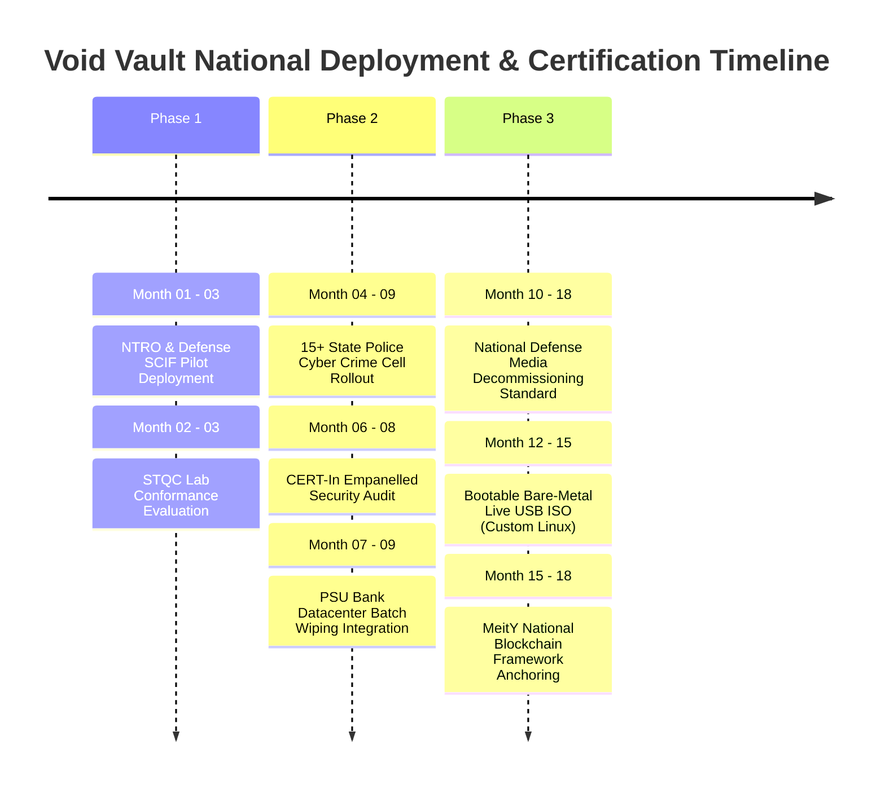

# 🚀 Feasibility, Impact & National Deployment Roadmap

## Executive Overview
Void Vault is engineered not merely as an academic competition proof-of-concept, but as a **production-viable, sovereign sovereign software utility** ready for institutional transition across Indian defense, law enforcement, and intelligence infrastructure.

---

## 📈 1. Multi-Dimensional Feasibility Assessment

### Technical Feasibility
- **100% Native Pure Rust:** Zero garbage collection pauses, deterministic real-time I/O, compile-time memory safety, and minimal binary size (< 15 MB).
- **Zero-Driver Architecture:** Operates entirely in user mode using standard Win32 Direct I/O (`CreateFileW`) and Linux `io_uring`, eliminating the kernel instability and driver signing vulnerabilities associated with legacy tools.
- **Resource Footprint:** Operates within **~118 MB RAM** and minimal CPU overhead, enabling deployment on low-power forensic field laptops and portable live USB systems.

### Financial & Defense Economic Feasibility
- **Sovereign Cost Avoidance:** Eliminates commercial per-drive wiping licenses (saving **₹1,500 to ₹4,000 per sanitized drive**). Decommissioning a single 10,000-server government datacenter yields over **₹1.5 Crores in direct license savings**.
- **Hardware Asset Reclamation:** Rather than physically degaussing or shredding expensive NVMe and SSD storage media, verified NIST SP 800-88 Purge allows secure redeployment across departments.

### Operational Feasibility
- **SCIF & Air-Gap Ready:** Zero external network calls, zero cloud registration, and self-contained cryptographic libraries.
- **Dual Interface Cockpit:** High-throughput 24/7 terminal CLI for scriptable automated batch jobs, coupled with an intuitive Tauri desktop GUI for non-technical field operators.

---

## 🏛️ 2. Triple-Pillar National Impact

```
┌────────────────────────────────────────────────────────────────────────────────────────┐
│                                TRIPLE-PILLAR NATIONAL IMPACT                           │
│                                                                                        │
│   [ SOCIAL & JUSTICE IMPACT ]          [ ECONOMIC & SOVEREIGN ]    [ ENVIRONMENTAL ]   │
│   • Accelerated Evidence Triage       • 100% Indigenous Atmanirbhar• Circular Hardware │
│   • BSA 2023 Sec 63 Court Admissibility• ₹0 Recurring Foreign Royalties Reuse vs Shred│
│   • Absolute Citizen Data Privacy     • Air-Gapped Intelligence Ops• E-Waste Reduction │
└────────────────────────────────────────────────────────────────────────────────────────┘
```

1. **Justice & Social Impact:** Accelerates forensic evidence acquisition for state police cyber cells. Enables automated generation of court-admissible BSA 2023 Section 63 certificates, eliminating trial delays.
2. **Economic & Sovereign Security:** Strengthens India's cyber self-reliance (Atmanirbhar Bharat), insulating critical defense infrastructure from foreign software supply-chain vulnerabilities and telemetry.
3. **Environmental Sustainability:** Promotes circular economy principles within government ITAD by replacing mandatory physical shredding with certified cryptographic sanitization, drastically reducing toxic electronic waste.

---

## 🗺️ 3. Phased National Rollout Roadmap



### Phase 1: Intelligence & SCIF Pilot (Months 1–3)
- Pilot deployment in controlled NTRO, Defense Cyber Agency (DCA), and Military Intelligence forensic laboratories.
- Formal evaluation against STQC (Standardisation Testing and Quality Certification) sanitization benchmarks.

### Phase 2: Law Enforcement & Banking Scale (Months 4–9)
- Expansion into 15+ State Cyber Crime Police Stations for digital evidence carving and chain-of-custody reporting.
- Integration into PSU Bank and data center decommissioning workflows for RBI & CERT-In compliance.
- Complete third-party source-code audit by CERT-In empanelled security auditors.

### Phase 3: National Decommissioning Standard (Months 10–18)
- Adoption as the official standard for Indian government media sanitization and decommissioning.
- Release of standalone, bootable bare-metal live USB media (custom minimal Linux environment).
- Anchoring session Merkle roots into the MeitY National Blockchain Framework (Vishvasya / NBFLite).
