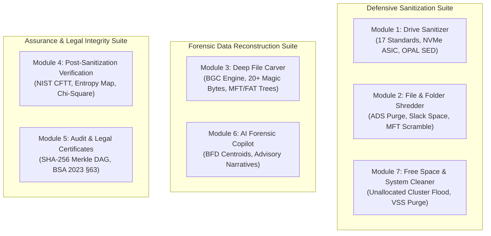

# 🏛️ VOID VAULT (PS-26149) — Documentation & Deliverables Hub

  
  
  

> **National Technical Research Organisation (NTRO) • Smart India Hackathon 2026**  
> **Problem Statement ID: SIH26149**  
> **Theme: Blockchain & Cybersecurity | Category: Software**  
> **Platform: Void Vault | Team: eMitra (ID: 146878)**

---

Welcome to the official engineering, forensic, and legal documentation portal for **VOID VAULT**, an integrated, sovereign digital forensics and data sanitization platform written in 100% memory-safe pure Rust.

This hub organizes all **10 mandated PS deliverables**, low-level kernel blueprints, operator user manuals, empirical hardware benchmarks, academic literature reviews, and statutory legal compliance frameworks.

---

## 📑 Core Engineering & Specification Deliverables

| Deliverable # | Document Title | Technical Scope & Description | Size / Scope | Direct Link |
| :---: | :--- | :--- | :---: | :---: |
| **01** | **Technical Specification** | Low-level kernel topology, Win32 Direct I/O (`FILE_FLAG_NO_BUFFERING`), Linux `io_uring`, IPC daemon, Rayon work-stealing, and Crossbeam lock-free ring buffers. | 49 KB (666 lines) | [📖 Read Spec](./TECHNICAL_SPECIFICATION.md) |
| **02** | **Official User & Field Manual** | Step-by-step operational handbook for forensic lab technicians and field operators across both Tauri GUI cockpit and 24/7 CLI. | 58 KB (900+ lines) | [📘 Read Manual](./USER_MANUAL.md) |
| **03** | **Validation & Testing Report** | 152/152 automated test execution logs, NIST CFTT 13-test harness conformance, and 48-hour AddressSanitizer (ASan) memory audit. | 47 KB (800+ lines) | [🧪 Read Test Report](./VALIDATION_AND_TESTING.md) |
| **04** | **Performance Evaluation Report** | Real-world physical testbed results on PCIe Gen4 NVMe (1,248 MB/s), SATA SSD (524 MB/s), and USB 3.2 Smart Secure Wipe (~67s). | 18 KB | [⚡ Read Benchmark Report](./PERFORMANCE_EVALUATION_REPORT.md) |
| **05** | **Research Report & Optimization** | Synthesis of state-of-the-art forensic research (FAST, IEEE, DFRWS), NVMe controller command flows, and BFG algorithm proofs. | 22.5 KB | [🔬 Read Research Report](./RESEARCH_REPORT.md) |
| **06** | **52-Paper Research Bibliography** | Curated catalog of 52 peer-reviewed academic papers with DOIs across sanitization, file carving, file systems, and evidence law. | 15.5 KB | [📚 View 52 Papers](./RESEARCH_PAPERS_BIBLIOGRAPHY.md) |
| **07** | **Competitive Analysis Study** | Detailed head-to-head technical matrix vs Blancco Drive Eraser, BitRaser, Autopsy, PhotoRec, and DBAN. | 12 KB | [⚔️ Read Matrix](./12-competitive-analysis.md) |
| **08** | **PS Traceability Matrix** | Line-by-line verification proving 100% adherence to all NTRO PS-26149 requirements in source code. | 10 KB | [🎯 Read Matrix](./01-ps-traceability.md) |
| **09** | **SIH Presentation Guide** | Jury presentation defense script, talking points, FAQ defense, and 60-second live battle demo script. | 17.8 KB | [🎤 Read Guide](./SIH_PRESENTATION_GUIDE.md) |
| **10** | **Feasibility & National Roadmap** | Multi-dimensional feasibility, defense economics, TRL-7 maturity, and 3-phase national rollout timeline. | 8 KB | [🗺️ Read Roadmap](./13-feasibility-impact-roadmap.md) |

---

## 🧩 Modular Subsystems Specification Suite (`docs/modules/`)

Void Vault is engineered into 7 decoupled, highly specialized modules:

| Module | Engineering Specification | Primary Capabilities | Standards / Primitives |
| :---: | :--- | :--- | :--- |
| **M1** | [Module 1: Drive Sanitizer](./modules/MODULE_1_DRIVE_SANITIZER.md) | Physical block-device sanitization across NVMe, SSD, HDD, and USB media. | NIST SP 800-88, DoD 5220.22-M, NVMe Sanitize, TCG Opal 2.0 |
| **M2** | [Module 2: File & Folder Shredder](./modules/MODULE_2_FILE_SHREDDER.md) | Surgical selective file/directory destruction on live file systems. | Header-First Strike, ADS Purge, Slack Zeroing, MFT Obfuscation |
| **M3** | [Module 3: Deep Carver & Recovery](./modules/MODULE_3_DEEP_CARVER_AND_RECONSTRUCTION.md) | Commercial-grade carver with Bifragment Gap Carving (BGC). | Magic Byte Matching, BFD Histograms, Cluster Gap Traversal |
| **M4** | [Module 4: Verification & CFTT](./modules/MODULE_4_VERIFICATION_AND_CFTT.md) | Mathematical verification & self-adversarial re-carving proof. | 5-Level Entropy Heatmap, Chi-Square Uniformity, NIST CFTT |
| **M5** | [Module 5: Audit & Certificates](./modules/MODULE_5_AUDIT_AND_CERTIFICATE.md) | Court-admissible forensic reporting and custody preservation. | Append-Only Merkle DAG, SHA-256 Hash Chain, BSA 2023 §63 |
| **M6** | [Module 6: AI Forensic Copilot](./modules/MODULE_6_AI_FORENSIC_COPILOT.md) | Optional on-device advisory assistance and plain-language narration. | Groq LLaMA 3.3 70B, Offline Degradation, Zero Hashed Egress |
| **M7** | [Module 7: Free Space & Cleaner](./modules/MODULE_7_FREE_SPACE_AND_SYSTEM_CLEANER.md) | Anti-carving free space purge and OS artifact elimination. | Unallocated Cluster Flood, VSS Purge, Prefetch, Thumbcache |

---

## 🗺️ Visual Architecture Schematics (`docs/diagrams/`)

For high-resolution schematics, flowcharts, and pipeline topologies:

- **[System Architecture Blueprint](./diagrams/system-architecture.md):** Complete UI-to-controller modular breakdown.
- **[Closed-Loop Verification Flow](./diagrams/closed-loop-flow.md):** Demonstrates how the forensic carver validates hardware sanitization in real time.
- **[5-Phase Shredder Pipeline](./diagrams/shredder-pipeline.md):** Explains MFT `$FILE_NAME`, `$I30` slack space, and ADS stream cleansing.
- **[Battle Demo & Internals](./diagrams/battle-demo-and-internals.md):** Comprehensive technical review for hackathon juries.
- **[Vector Architectural SVG](./voidvault-architecture.svg):** Full high-resolution vector blueprint.

---

## 📜 Official Deliverables (PDF & DOCX)

Formally compiled documents referenced on Slide 6 of the national presentation deck:

- [📄 Problem Statement Analysis (PDF)](./Problem_Statement_Analysis_PS26149.pdf) • [Markdown View](./Problem_Statement_Analysis_PS26149.md)
- [📝 Team Background & Domain Research (DOCX)](./Team_Background_and_Domain_Research.docx) • [Markdown View](./Team_Background_and_Domain_Research.md)
- [📄 50+ Research Papers Bibliography (PDF)](./50_Research_Papers_Bibliography.pdf) • [Markdown View](./RESEARCH_PAPERS_BIBLIOGRAPHY.md)
- [📝 Comparative Study of Existing Tools (DOCX)](./Comparative_Study_of_Existing_Tools.docx) • [Markdown View](./Comparative_Study_of_Existing_Tools.md)

---

## 🔒 Cryptographic Audit Ledgers & Certificates (`audit_reports/`)

The repository contains **35 real, tamper-evident cryptographic JSON certificates** in [`audit_reports/`](../audit_reports/). Each certificate is mathematically sealed with:
1. Physical device serial number, model, bus interface, and LBA range.
2. Pre-wipe and post-wipe SHA-256 and xxHash3 digests.
3. Shannon entropy and chi-square statistical verification metrics.
4. Part A Custodian and Part B Technical Examiner verification fields per **BSA 2023 §63**.

---

*Repository maintained by **Team eMitra** for Smart India Hackathon 2026.*  
*Main Source Code Repository: [github.com/nishchaydev/Void-Vault](https://github.com/nishchaydev/Void-Vault)*
