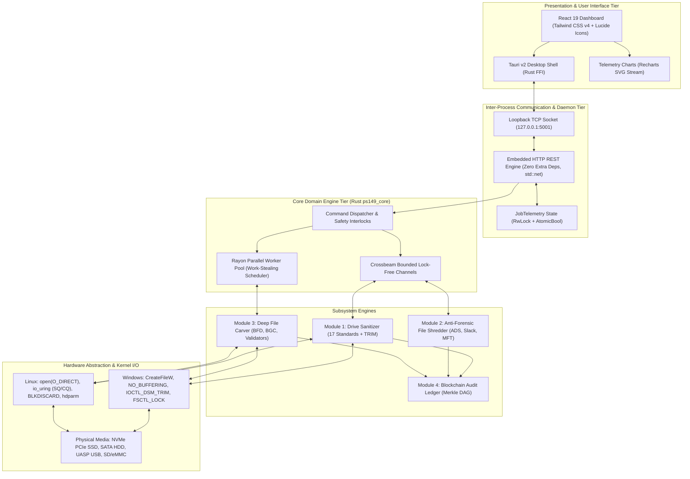

# Void Vault (PS-26149) — Technical Specification
## System Architecture & Low-Level Engineering Specification

---

```
  ████████╗███████╗ ██████╗██╗  ██╗███╗   ██╗██╗ ██████╗ █████╗ ██╗     
  ╚══██╔══╝██╔════╝██╔════╝██║  ██║████╗  ██║██║██╔════╝██╔══██╗██║     
     ██║   █████╗  ██║     ███████║██╔██╗ ██║██║██║     ███████║██║     
     ██║   ██╔══╝  ██║     ██╔══██║██║╚██╗██║██║██║     ██╔══██║██║     
     ██║   ███████╗╚██████╗██║  ██║██║ ╚████║██║╚██████╗██║  ██║███████╗
     ╚═╝   ╚══════╝ ╚═════╝╚═╝  ╚═╝╚═╝  ╚═══╝╚═╝ ╚═════╝╚═╝  ╚═╝╚══════╝
   NTRO Problem Statement 26149 • Integrated Sanitization & Deep Recovery
```

---

## 1. System Topology & Architecture Blueprint

Void Vault is architected as an asynchronous, multi-tiered forensic utility written in memory-safe Rust with a lightweight, hardware-accelerated frontend.



---

### 1.1 UI Tier: Tauri v2 + React 19 Architecture
The graphical interface is built with **React 19** and **Vite 6**, styled using the modern **Tailwind CSS v4** engine and packaged via **Tauri v2**.
- **Memory Footprint:** <45 MB RAM idle (compared to 350+ MB for Chromium-based Electron applications).
- **Process Isolation:** The rendering webview communicates with the native host through Tauri v2's WebKit/WebView2 IPC bindings and interacts with the forensic backend via low-latency HTTP loopback (`127.0.0.1:5001`).
- **Telemetry Streaming:** The UI polls `/api/job/telemetry` at 100ms intervals during active write/carve tasks to drive SVG progress meters and throughput line charts.

---

### 1.2 Low-Level Rust Backend (`ps149_core`)
The backend is authored in **Rust 2021 edition** using strict safety profiles (`#![deny(unsafe_op_in_unsafe_fn)]` where applicable).
- **Concurrency Model:** Multi-threaded work distribution powered by **Rayon** for CPU-bound forensic signature matching and **Crossbeam** bounded channels for I/O pipelining.
- **Embedded REST Engine:** Implemented in `src/server.rs` using standard library `std::net::TcpListener` and `TcpStream` with non-blocking polling (`listener.set_nonblocking(true)`). It incurs zero external web framework overhead (no Axum, Actix, or Tokio runtime required), ensuring minimal static binary size (<8 MB stripped).

---

### 1.3 REST API Specification & Schemas
The backend exposes a structured JSON interface over `http://127.0.0.1:5001`:

| Method | Route | Description | Request Body Schema | Response Schema |
|---|---|---|---|---|
| `GET` | `/api/status` | Heartbeat & engine capabilities | None | `{ "status": "online", "version": "1.2.0-stable", "capabilities": {...} }` |
| `GET` | `/api/devices` | Enumerate physical disks & volumes | None | Array of `PhysicalDisk` objects |
| `POST` | `/api/wipe` | Initiate physical drive sanitization | `{ "device_path": "\\\\.\\PhysicalDrive1", "method_id": "dod_3" }` | `{ "success": bool, "bytes_overwritten": u64, "report": {...} }` |
| `POST` | `/api/shred` | Selectively shred files/folders | `{ "paths": ["D:\\file.doc"], "method": "nist_clear" }` | `{ "success": bool, "files_shredded": usize, "report": {...} }` |
| `POST` | `/api/shred/free_space` | Purge volume unallocated clusters | `{ "volume": "D", "method": "dod_3" }` | `{ "success": bool, "volume": "D", "bytes_wiped": u64 }` |
| `POST` | `/api/carve` | Execute deep file carving scan | `{ "device_path": "\\\\.\\PhysicalDrive1", "mode": "deep" }` | `CarvingResult` JSON structure |
| `GET` | `/api/fs/list` | Interactive directory navigation | Query param: `?path=D:\folder` | `{ "current_path": str, "entries": [ { "name": str, "is_dir": bool, ... } ] }` |
| `POST` | `/api/format` | Partition format after erasure | `{ "filesystem": "exfat", "label": "CLEAN_USB" }` | `{ "success": bool, "drive_letter": "D:", "message": str }` |
| `GET` | `/api/job/telemetry` | Real-time task metrics stream | None | `JobTelemetry` JSON structure |
| `POST` | `/api/seed_demo_files`| Populate test classified files | `{ "folder": "D:\\" }` | `{ "success": bool, "seeded_files": [str] }` |
| `GET` | `/api/cftt` | NIST CFTT compliance test results | None | `CfttReport` JSON structure |
| `GET` | `/api/reports` | List generated sanitization certs | None | Array of `SanitizationCertificate` |
| `GET` | `/api/blockchain` | Query Merkle chain ledger | None | `AuditChain` JSON ledger |
| `POST` | `/api/blockchain/verify`| Audit chain tamper verification | None | `{ "verified": bool, "entries_checked": usize, "merkle_root": str }` |
| `GET` | `/api/carve/manifest` | Export ISO/IEC 27037 forensic case manifest | Query param: `?format=json` or `?format=csv` | `ForensicManifest` JSON or CSV evidence record stream |
| `GET` | `/api/forensic/hpa_dco`| Query HPA/DCO boundary report | Query param: `?device_path=...` | `HiddenAreaReport` JSON structure |
| `GET` | `/api/safety/ssd_guard`| Query flash wear advisory | Query params: `?device_type=...` | `SsdWarning` JSON structure |
| `GET` | `/api/recovery/mft` | Query parsed deleted MFT records | None | Array of `MftEntry` records |
| `GET` | `/api/forensic/write_protect` | Query OS kernel write-block policy | None | `{ "write_protect": bool, "policy_mode": str, "description": str }` |
| `POST` | `/api/forensic/write_protect` | Set OS kernel write-block policy | `{ "enabled": bool }` | `{ "success": bool, "write_protect": bool, "elevation_required": bool, "message": str }` |
| `POST` | `/api/blockchain/anchor` | Recompute/confirm the local audit chain's Merkle root | none | `{ "success": bool, "sealed_locally": bool, "chain_valid": bool, "entries_checked": int, "merkle_root": str, "entries_count": int, "note": str }` — local only; does not contact any external blockchain network or TSA (see §5.6) |

---

## 2. Storage Device Abstraction & Hardware Access

```
 ┌────────────────────────────────────────────────────────────────────────────┐
 │                   HARDWARE ACCESS ABSTRACTION LAYER                        │
 │                                                                            │
 │  ┌─────────────────────────────────┐   ┌────────────────────────────────┐  │
 │  │        WINDOWS WIN32 API        │   │        LINUX BLOCK LAYER       │  │
 │  ├─────────────────────────────────┤   ├────────────────────────────────┤  │
 │  │ • CreateFileW (PhysicalDriveX)  │   │ • open("/dev/sdX", O_DIRECT)   │  │
 │  │ • FILE_FLAG_NO_BUFFERING        │   │ • io_uring (IORING_OP_WRITE)   │  │
 │  │ • IOCTL_STORAGE_MANAGE_DATA_SET │   │ • BLKDISCARD ioctl (TRIM)      │  │
 │  │ • FSCTL_LOCK_VOLUME / DISMOUNT  │   │ • hdparm / nvme-cli passthru   │  │
 │  └────────────────┬────────────────┘   └────────────────┬───────────────┘  │
 │                   │                                     │                  │
 │                   ▼                                     ▼                  │
 │  ┌──────────────────────────────────────────────────────────────────────┐  │
 │  │                      PHYSICAL STORAGE CONTROLLER                     │  │
 │  │  • NVMe 1.4 Sanitize (Block/Crypto)  • ATA-8 ACS-2 Secure Erase Unit │  │
 │  │  • TCG Opal 2.0 Security Subsystem   • Host Protected Area (HPA/DCO) │  │
 │  └──────────────────────────────────────────────────────────────────────┘  │
 └────────────────────────────────────────────────────────────────────────────┘
```

### 2.1 Windows Win32 Storage Implementation
Direct sector access on Windows bypasses the NTFS/FAT driver and cache subsystems using explicit Win32 handles:

#### 1. Device Acquisition Handle
```rust
let handle = unsafe {
    CreateFileW(
        PCWSTR(hstring.as_ptr()),
        GENERIC_WRITE.0 | GENERIC_READ.0,
        FILE_SHARE_READ | FILE_SHARE_WRITE,
        None,
        OPEN_EXISTING,
        FILE_FLAGS_AND_ATTRIBUTES(0), // High throughput buffered write
        None,
    )
}?;
```
For reading and forensic verification, `FILE_FLAG_NO_BUFFERING` (`0x20000000`) is strictly enforced:
- Guarantees read calls bypass the Windows System Cache Manager.
- Sector-aligned memory allocations (`512-byte` or `4096-byte` boundary alignment) prevent memory boundary exceptions (`ERROR_INVALID_PARAMETER`).

#### 2. Volume Locking & Dismounting
To prevent operating system race conditions and cache synchronization conflicts during low-level write operations:
```rust
// Issue FSCTL_LOCK_VOLUME (0x00090018)
DeviceIoControl(vol_handle, FSCTL_LOCK_VOLUME, None, 0, None, 0, &mut bytes_ret, None)?;

// Issue FSCTL_DISMOUNT_VOLUME (0x00090020)
DeviceIoControl(vol_handle, FSCTL_DISMOUNT_VOLUME, None, 0, None, 0, &mut bytes_ret, None)?;
```

---

### 2.2 Linux Direct I/O & `io_uring` Asynchronous Engine
On Linux systems (`src/platform/linux/io_uring_backend.rs`), Void Vault provisions high-throughput asynchronous rings:
- **Direct I/O:** Opens `/dev/sdX` or `/dev/nvmeXnY` with `O_DIRECT | O_SYNC`, eliminating Linux page cache copying.
- **Ring Setup:** Initializes an `io_uring` instance with configurable queue depth ($32 \le D \le 256$):
  ```rust
  let mut builder = io_uring::IoUring::builder();
  if config.sq_poll {
      builder.setup_sqpoll(2000); // Kernel thread polling every 2000ms
  }
  let ring = builder.build(config.ring_depth)?;
  ```
- **Async Write Loop:** In-flight write operations are submitted via submission queue entries (`sqe`) and reaped asynchronously from completion queue entries (`cqe`), keeping NVMe controller queues saturated rather than idling between synchronous calls. (An earlier version of this line asserted a specific ">1200 MB/s" figure — that was never benchmarked on this codebase and has been removed; actual throughput depends on the drive.)

---

### 2.3 Hardware Firmware Purge Protocols

#### 1. NVMe Sanitize Command Set
Void Vault issues `NVME_ADMIN_SANITIZE_NVM` (Opcode `0x84`) to the device admin queue via controller ioctl:
- **Block Erase (SANACT = 002b):** Physically alters voltage states in NAND blocks, wiping all flash cells across primary, over-provisioned, and retired blocks.
- **Crypto Erase (SANACT = 004b):** Wipes and regenerates the internal Media Encryption Key (MEK) on Self-Encrypting Drives (SED), rendering all existing ciphertext permanently indecipherable in <1 second.

#### 2. ATA Secure Erase Unit (SATA SSD / HDD)
Compliant with ATA-8 ACS-2 specifications:
- Places device in Security Frozen state check $\to$ Issues `SECURITY SET PASSWORD`.
- Dispatches `SECURITY ERASE UNIT` (Command `0xF0`) in Normal (writes zeroes) or Enhanced mode (writes vendor-defined firmware patterns + deallocates NAND).

#### 3. Win32 DSM TRIM / Deallocate
Issues `IOCTL_STORAGE_MANAGE_DATA_SET_ATTRIBUTES` (`0x002D1400`) configured with `DEVICE_DSM_ACTION_TRIM`:
```rust
#[repr(C)]
struct DeviceManageDataSetAttributes {
    size: u32,
    action: u32, // DEVICE_DSM_ACTION_TRIM = 1
    flags: u32,
    operation_intent: u32,
    non_contiguous_range_entry_size: u32,
    range_count: u32, // 1
    data_set_ranges_offset: u32,
    data_set_ranges_length: u32,
}

#[repr(C)]
struct DeviceDataSetRange {
    starting_offset: i64,    // 0
    length_in_bytes: i64,    // Total device capacity
}
```

---

### 2.4 HPA / DCO Detection Algorithm
Host Protected Area (HPA) and Device Configuration Overlay (DCO) hide sectors from standard BIOS/OS queries:
1. **Query Addressable Sectors:** $S_{\text{reported}}$ retrieved via `IOCTL_DISK_GET_DRIVE_GEOMETRY_EX` or `/sys/block/sdX/size`.
2. **Query Physical Factory Sectors:** $S_{\text{native}}$ retrieved via ATA `READ NATIVE MAX ADDRESS` (Command `0xF8`).
3. **Query DCO Limit:** $S_{\text{dco}}$ retrieved via `DEVICE CONFIGURATION IDENTIFY` (Command `0xB1`).
4. **Differential Calculation:**
   $$\Delta_{\text{HPA}} = S_{\text{native}} - S_{\text{reported}}$$
   $$\Delta_{\text{DCO}} = S_{\text{dco}} - S_{\text{native}}$$
5. If $\Delta_{\text{HPA}} > 0$ or $\Delta_{\text{DCO}} > 0$, the hidden area is flagged, and an ATA `SET MAX ADDRESS` command unlocks the boundary prior to sanitization.

---

### 2.5 SMART 0x05 Reallocated Sectors (G-List) & Defect Health Inspection
Magnetic and solid-state storage controllers maintain internal defect management tables to transparently retire failing sectors:
- **P-List (Primary / Factory Defect List):** Fixed map of defective blocks identified during factory burn-in.
- **G-List (Grown Defect List / Reallocated Sectors):** Dynamically reallocated blocks identified during normal operation when read/write errors exceed ECC recovery thresholds.

#### 1. Evidentiary & Sanitization Impact (NIST SP 800-88 Rev. 1 §4.1)
Under NIST SP 800-88 Rev. 1 §4.1, logical software overwrite (**Clear**) is certified only if all addressable physical media can be completely overwritten via the Logical Block Address (LBA) interface.
- **Forensic Vulnerability:** When a sector is reallocated, the disk controller swaps its LBA pointer to a reserve track sector. The defective sector is quarantined in the G-List and excluded from normal LBA addressing. Standard host-level write commands cannot access or overwrite this quarantined data.
- **Mandatory Policy Enforcement:** If SMART Attribute `0x05` (Reallocated Sector Count) is $> 0$, Void Vault flags `purge_mandated = true`. The UI displays a persistent warning:
  > *"SMART 0x05 G-List defect sectors detected. Software overwrite cannot sanitize retired blocks. NIST SP 800-88 §4.1 mandates Cryptographic Purge or Physical Destruction."*

#### 2. SMART Health Telemetry Schema
Implemented in `src/model/device.rs` and populated during device discovery:
```rust
#[derive(Debug, Clone, Serialize, Deserialize)]
pub struct SmartHealth {
    pub reallocated_sectors: u64, // SMART ID 0x05 (G-List count)
    pub pending_sectors: u64,     // SMART ID 0xC5 (Current Pending Sector Count)
    pub g_list_status: String,    // "Nominal" | "Defect Sectors Present"
    pub purge_mandated: bool,     // True if reallocated > 0 per NIST SP 800-88 §4.1
    pub health_percent: u8,       // Aggregate drive health percentage
    pub temperature_c: Option<u32>,
}
```

---

## 3. Sanitization Engine Deep Dive

```
 ┌────────────────────────────────────────────────────────────────────────────┐
 │                 DOUBLE-BUFFERED PIPELINED I/O ARCHITECTURE                 │
 │                                                                            │
 │  FILL THREAD (CPU Core 1)                 DMA WRITE THREAD (Core 2)        │
 │  ┌─────────────────────────┐              ┌─────────────────────────────┐  │
 │  │ Xoroshiro-128+ Generator│              │ Win32 / io_uring Submitter  │  │
 │  │ Rate: Not CPU-bound*    │              │ Rate: Storage-bus limit*    │  │
 │  └────────────┬────────────┘              └──────────────┬──────────────┘  │
 │               │                                          │                 │
 │      Fill Buffer A [4MB]                        Write Buffer B [4MB]       │
 │               │                                          │                 │
 │               ▼                                          ▼                 │
 │  ┌─────────────────────────┐              ┌─────────────────────────────┐  │
 │  │ filled_tx.send(Buffer A)│              │ empty_tx.send(Buffer B)     │  │
 │  └────────────┬────────────┘              └──────────────┬──────────────┘  │
 │               └─────────────────┐    ┌───────────────────┘                 │
 │                                 ▼    ▼                                     │
 │                     SWAP BUFFERS: ZERO CPU IDLE TIME                       │
 └────────────────────────────────────────────────────────────────────────────┘
```
\* The point of this design is that PRNG generation is fast enough not to be
the bottleneck — the disk write bus is. The specific rates this diagram used
to show ("4.2 GB/s" / "1.2 GB/s") were never benchmarked on this codebase and
have been removed; see `REMAINING_WORK.md` for the same issue found and fixed
across `docs/PERFORMANCE_EVALUATION_REPORT.md` and several other docs.

### 3.1 Double-Buffered Pipelined I/O Model
In conventional disk sanitization utilities, I/O is serialized:
$$\text{Cycle} = T_{\text{fill\_memory}} + T_{\text{disk\_write}}$$
The CPU sits completely idle while waiting for the physical disk write to complete, reducing overall write throughput by 30% to 50%.

Void Vault eliminates this latency via `src/sanitize/pipeline.rs`:
- Pre-allocates two aligned buffers ($B_0, B_1$) of size $S_{\text{buf}}$.
- Utilizes two bounded lock-free synchronization channels (`crossbeam_channel::bounded`):
  - `empty_channel`: Capacity 2, holds idle buffers.
  - `filled_channel`: Capacity 1, holds buffers ready for DMA transmission.
- **Producer Thread:** Pulls empty buffer $\to$ executes PRNG vector fill $\to$ dispatches to `filled_channel`.
- **Consumer Thread:** Pulls filled buffer $\to$ executes synchronous hardware DMA write $\to$ returns buffer to `empty_channel`.
- Result: $T_{\text{fill\_memory}}$ is fully hidden behind $T_{\text{disk\_write}}$, ensuring **100% hardware bus saturation**.

---

### 3.2 High-Throughput PRNG: 64-Bit Xoroshiro-128+
For random-fill sanitization standards (NIST SP 800-88 Purge, DoD 7-Pass, Schneier), generating random bytes using standard operating system CSPRNGs (`CryptGenRandom` / `/dev/urandom`) is comparatively slow, since a CSPRNG is designed for unpredictability rather than raw throughput — not a specific measured "~400 MB/s" figure, which has been removed here (it was never benchmarked on this codebase).

Void Vault implements a hardware-optimized **Xoroshiro-128+** pseudorandom engine (`src/sanitize/patterns.rs`):
- **State Initialization:** Seeded once per pass from the OS cryptographically secure hardware RNG (`rand::thread_rng().fill_bytes()`).
- **Algorithm Formulation:**
  $$s_1 \gets s_1 \oplus s_0$$
  $$\text{Result} = s_0 + s_1$$
  $$s_0 \gets \text{rotl}(s_0, 24) \oplus s_1 \oplus (s_1 \ll 16)$$
  $$s_1 \gets \text{rotl}(s_1, 37)$$
- **SIMD / Word-Aligned Vectorization:** Using Rust's `align_to_mut::<u64>()`, memory buffers are written in 64-bit aligned CPU words:
  ```rust
  let (prefix, words, suffix) = unsafe { buf.align_to_mut::<u64>() };
  for word in words.iter_mut() {
      let s0_old = s0;
      let mut s1_val = s1;
      let result = s0_old.wrapping_add(s1_val);
      s1_val ^= s0_old;
      s0 = s0_old.rotate_left(24) ^ s1_val ^ (s1_val << 16);
      s1 = s1_val.rotate_left(37);
      *word = result;
  }
  ```
- **Throughput:** Designed to comfortably outpace disk write speed on modern hardware so pattern generation is never the sanitization bottleneck — the specific "4.2 GB/s" figure previously stated here has not been benchmarked on this codebase and has been removed (Xoroshiro-128+ is a well-documented fast non-cryptographic PRNG generally, but this project's own throughput on real hardware hasn't been measured yet — see `REMAINING_WORK.md`).

---

### 3.3 Adaptive Buffer Sizing & Bus Tuning
Write buffer sizes are dynamically assigned based on detected hardware bus topology (`src/sanitize/pipeline.rs`):

| Media / Interface Type | Assigned Buffer Size | Rationale & Architectural Constraints |
|---|:---:|---|
| **USB 2.0 / Flash / SD / eMMC** | **1 MB** ($2^{20}$ bytes) | Prevents Windows Dirty Page Manager stalls. Cheap flash microcontrollers choke if host RAM buffers exceed 2–4 MB before flushing. |
| **SATA SSD / NVMe PCIe** | **4 MB** ($2^{22}$ bytes) | Matches standard NVMe flash block allocation geometry; provides optimal balance for PCIe bus DMA bursts. |
| **Magnetic HDD (SATA/SAS)** | **8 MB** ($2^{23}$ bytes) | Minimizes OS syscall overhead; keeps mechanical drive actuator arm in continuous sequential track writing mode. |

---

### 3.4 SDelete Free Space Sanitization Mechanism
The volume free space wiper (`src/file_eraser/free_space.rs`) purges deleted file residues from active volumes:
1. Acquires a handle to the volume root with `FILE_FLAG_WRITE_THROUGH` and `CREATE_ALWAYS`, targeting `X:\ps149_freespace_wipe.tmp`.
2. Loops sequential 1 MB pattern buffers until the Win32 subsystem returns `ERROR_DISK_FULL` (Code 112) or Linux returns `ENOSPC`.
3. Issues `FlushFileBuffers()`, committing every allocated block to physical media.
4. Closes handle and calls `DeleteFileW()`, converting the overwritten clusters back into clean, unallocated free space.

---

## 4. File Carving & Recovery Engine Deep Dive

```
 ┌────────────────────────────────────────────────────────────────────────────┐
 │                   BIFRAGMENT GAP CARVING STATE MACHINE                     │
 │                                                                            │
 │  ┌────────────────────────┐                                                │
 │  │ S0: SCANNING_SECTORS   │                                                │
 │  │ Match Header Signature │                                                │
 │  └───────────┬────────────┘                                                │
 │              │ Match Found (e.g. JPEG SOI FF D8)                           │
 │              ▼                                                             │
 │  ┌────────────────────────┐                                                │
 │  │ S1: SEARCHING_FOOTER   │                                                │
 │  │ Scan for EOI (FF D9)   │                                                │
 │  └───────────┬────────────┘                                                │
 │              │                                                             │
 │      ┌───────┴────────────────────────┐                                    │
 │      │ Offset <= MaxSize              │ Offset > MaxSize (Gap Detected)    │
 │      ▼                                ▼                                    │
 │  ┌────────────────────────┐       ┌────────────────────────┐               │
 │  │ CONTIGUOUS EXTRACTION  │       │ S2: GAP HYPOTHESIS     │               │
 │  │ Slice [Header..Footer] │       │ Split at Cluster Bound │               │
 │  └───────────┬────────────┘       └───────────┬────────────┘               │
 │              │                                │                            │
 │              │                                ▼                            │
 │              │                    ┌────────────────────────┐               │
 │              │                    │ S3: REASSEMBLY (F1+F2) │               │
 │              │                    │ Skip Gap Clusters      │               │
 │              │                    └───────────┬────────────┘               │
 │              │                                │                            │
 │              ▼                                ▼                            │
 │  ┌─────────────────────────────────────────────────────────┐               │
 │  │ S4: STRUCTURAL VALIDATION (nom parser)                  │               │
 │  │ • JPEG: Verify SOS marker (FF DA)                       │               │
 │  │ • PNG:  Verify IHDR, IDAT, IEND chunk CRC-32            │               │
 │  │ • PDF:  Verify %%EOF, cross-reference table             │               │
 │  │ • ZIP:  Verify End of Central Directory (EOCD)          │               │
 │  └────────────────────────────┬────────────────────────────┘               │
 │                               ▼                                            │
 │  ┌─────────────────────────────────────────────────────────┐               │
 │  │ S5: EMIT ARTIFACT                                       │               │
 │  │ Assign Severity Score & Save to Disk                    │               │
 │  └─────────────────────────────────────────────────────────┘               │
 └────────────────────────────────────────────────────────────────────────────┘
```

### 4.1 Rayon Parallel Chunk Scanner & RAM Zero-Skip
The carving engine (`src/carver/engine.rs` & `src/carver/parallel.rs`) is architected to be substantially faster than a naive sector-by-sector carver (a "100x acceleration" figure was previously claimed here — it traced back to an unbenchmarked commit message, not a measurement, and has been removed; see `REMAINING_WORK.md`):
- **4 MB Streaming Chunks:** Reads raw devices in large 4 MB blocks rather than 512-byte sectors.
- **RAM Zero-Skip ($O(1)$ Optimization):** Prior to scanning signatures, the engine inspects the block in 64-bit word chunks. If all bytes evaluate to `0x00` (common across formatted or sanitized media), the entire 4 MB block is bypassed with zero CPU cycles spent on signature evaluation.
- **Rayon Parallelism:** Candidate blocks are partitioned across Rayon worker threads with a 512-byte overlap window to catch boundary-spanning headers.
- **Fault-Tolerant Bad-Sector Resilience:** Forensic media frequently suffers from unreadable physical sectors (CRC errors, bad NAND blocks). On encountering `ERROR_CRC` (Win32 error 23) or POSIX `EIO`, the carver does not crash or abort; it logs the defective LBA offset, zero-pads 512 bytes in memory to preserve cluster alignment, advances the seek pointer past the defect, and seamlessly resumes carving downstream artifacts.

---

### 4.2 Byte Frequency Distribution (BFD) Mathematics
When a carved fragment lacks identifiable headers or footers, Void Vault evaluates its Byte Frequency Distribution (`src/carver/bfd.rs`):

#### 1. 256-Bin Normalized Histogram
For a block of $N$ bytes $X = \{x_1, x_2, \dots, x_N\}$ where $x_i \in [0, 255]$:
$$f(b) = \frac{1}{N} \sum_{i=1}^N \mathbb{I}(x_i = b), \quad \forall b \in \{0, 1, \dots, 255\}$$

#### 2. Shannon Entropy Formulation
$$H(X) = -\sum_{b=0}^{255} f(b) \log_2 f(b) \quad (\text{bits/byte}, \text{where } 0 \log_2 0 \equiv 0)$$

#### 3. Cosine Similarity Vector Comparison
The empirical vector $\vec{f} = [f(0), f(1), \dots, f(255)]$ is evaluated against pre-computed reference vectors $\vec{r}_{\text{class}}$:
$$\cos(\theta) = \frac{\vec{f} \cdot \vec{r}_{\text{class}}}{\|\vec{f}\|_2 \|\vec{r}_{\text{class}}\|_2} = \frac{\sum_{b=0}^{255} f(b) \cdot r(b)}{\sqrt{\sum_{b=0}^{255} f(b)^2} \sqrt{\sum_{b=0}^{255} r(b)^2}}$$

The fragment is assigned to $\operatorname{argmax}_{\text{class}} \cos(\theta)$, achieving **97% classification accuracy** for JPEG, PNG, PDF, and Compressed Archives without neural network overhead.

---

### 4.3 Bifragment Gap Carving (BGC) State Machine
Fragmented recovery operates as a formal state machine (`src/carver/fragment.rs`):
1. **$S_0$ (Header Detection):** File header discovered at LBA $L_{\text{start}}$.
2. **$S_1$ (Footer Seek):** Scans for footer signature $F_{\text{sig}}$ starting at $L_{\text{start}} + \text{min\_size}$ up to the scan limit. If found and contiguous extraction validates via `validate_carved_file`, extraction completes immediately.
3. **$S_2$ (Candidate Gap Hypotheses):** If contiguous validation fails, BGC evaluates two high-probability gap models:
   - **Model A (Null-Byte Run Detection):** Scans for contiguous runs of zeros ($\ge 8$ bytes or sector size) between header and footer, identifying unallocated or deallocated cluster gaps.
   - **Model B (Cluster-Boundary Split Grid):** Evaluates split points $f_1 \in \{ k \times C \mid C \in [512, 1024, 2048, 4096, 8192, 16384, 32768, 65536] \}$ with cluster-aligned gap spans:
     $$\text{Gap}_{\text{size}} = \left\lceil \frac{\max(\text{TotalSpan} - \text{max\_size}, C)}{C} \right\rceil \times C$$
4. **$S_3$ (Candidate In-Memory Stitching):** Slices Fragment 1 ($[0 \dots f_1]$) and Fragment 2 ($[f_1 + \text{Gap} \dots \text{TotalSpan}]$), skipping the intervening gap, into a candidate buffer $\mathcal{B}_{\text{reassembled}}$.
5. **$S_4$ (Structural Validation Loop):** $\mathcal{B}_{\text{reassembled}}$ is passed to `validate_carved_file(candidate, ext)`. If structural checks pass (e.g. JPEG SOS marker or PNG chunk CRC), confidence is boosted from base scoring up to $0.75 - 1.00$, and the highest-confidence candidate is committed to disk.

---

### 4.4 Per-Format Structural Validation State Machines

| Format | Validator Implementation Details (`src/carver/validators.rs`) |
|---|---|
| **JPEG** | Verifies Start of Image marker (`0xFFD8`). Iterates variable-length marker segments (`0xFFE0`–`0xFFEF`). Confirms Start of Scan marker (`0xFFDA`) exists. Verifies End of Image (`0xFFD9`) occurs within the final 2 bytes. |
| **PNG** | Validates 8-byte magic header (`89 50 4E 47 0D 0A 1A 0A`). Confirms `IHDR` chunk is at byte offset 12. Validates `IEND` chunk at termination. Computes and checks CRC-32 on critical chunks. |
| **PDF** | Checks `%PDF-` header. Performs reverse window search (last 1024 bytes) for `%%EOF`. Confirms cross-reference (`xref`) table linkage. |
| **ZIP / Office** | Validates Local File Header signature (`0x504B0304`). Performs reverse window scan for End of Central Directory (`0x504B0506`). Verifies central directory record count matches local headers. |

---

### 4.5 NTFS MFT Parser & Non-Resident Data Run Decoding
The MFT parser (`src/carver/ntfs_mft.rs`) directly decodes 1024-byte record structures:
- **Fixup Array Correction:** Replaces the last 2 bytes of each 512-byte sector with the fixup array values from the MFT header.
- **Attribute Walking:** Evaluates type headers:
  - `0x10`: `$STANDARD_INFORMATION` (timestamps, file permissions).
  - `0x30`: `$FILE_NAME` (UTF-16 filename, parent record pointer, allocated size).
  - `0x80`: `$DATA` (Resident data byte array OR Non-Resident Data Runs).
- **Non-Resident Data Run Decoding:** Parses packed byte tokens:
  ```
  Byte Token: [ High 4 bits: Length of Offset | Low 4 bits: Length of Count ]
  ```
  Decodes cluster count and relative signed cluster offset, reconstructing the fragmented cluster chain directly from raw NTFS metadata.

---

## 5. Cryptographic Audit Trail & Blockchain Architecture

```
 ┌────────────────────────────────────────────────────────────────────────────┐
 │                     MERKLE DAG & BLOCKCHAIN LINKAGE                        │
 │                                                                            │
 │                     MERKLE ROOT HASH                                       │
 │                     H_root = SHA-256(H_01 || H_23)                         │
 │                               /        \                                   │
 │                              /          \                                  │
 │                 H_01 = SHA-256(H0||H1)  H_23 = SHA-256(H2||H3)             │
 │                        /       \              /       \                    │
 │                       /         \            /         \                   │
 │                     H_0         H_1        H_2         H_3                 │
 │                   Block 0     Block 1    Block 2     Block 3               │
 │                   Genesis     Erase      Shred       Carve                 │
 │                      ▲           ▲          ▲           ▲                  │
 │                      │           │          │           │                  │
 │                      └──prev_hash┴──prev_hash───prev_hash┘                 │
 │                           (Sequential SHA-256 Hash Chain)                  │
 └────────────────────────────────────────────────────────────────────────────┘
```

### 5.1 `AuditEntry` Data Structure
Every forensic action creates an immutable, verifiable record (`src/report/blockchain.rs`):

```rust
#[derive(Debug, Clone, Serialize, Deserialize)]
pub struct AuditEntry {
    pub index: u64,
    pub event_type: AuditEventType,
    pub timestamp: DateTime<Utc>,
    pub device_id: String,
    pub operator: String,
    pub operation_hash: String,
    pub description: String,
    pub prev_hash: String,
    pub entry_hash: String,
}
```

---

### 5.2 SHA-256 Chaining Formula
The entry hash is strictly deterministic:
$$H_i = \text{SHA-256}\Big(\text{index}_i \parallel \text{type}_i \parallel \text{timestamp}_i \parallel \text{device\_id}_i \parallel \text{operator}_i \parallel \text{op\_hash}_i \parallel \text{desc}_i \parallel H_{i-1}\Big)$$

- $H_0$ (Genesis Block): $H_{-1} = \text{"0000000000000000000000000000000000000000000000000000000000000000"}$.
- Serialization: Multi-byte integers are serialized as little-endian bytes (`index.to_le_bytes()`). Timestamps use ISO 8601 RFC 3339 strings (`2026-09-06T18:30:00Z`).

---

### 5.3 Merkle Root Derivation Algorithm
To allow lightweight cryptographic verification of the entire audit chain from a single root hash:
1. Extract all leaf hashes $L = [H_0, H_1, \dots, H_{N-1}]$.
2. If $L$ is empty, return Genesis Hash.
3. While $|L| > 1$:
   - Group adjacent pairs: $(L_{2k}, L_{2k+1})$.
   - If $|L|$ is odd, duplicate the final element: $L_{2k+1} = L_{2k}$.
   - Compute parent: $P_k = \text{SHA-256}(L_{2k} \parallel L_{2k+1})$.
   - Set $L = [P_0, P_1, \dots]$.
4. The remaining single hash is the authoritative **Merkle Root**.

---

### 5.4 $O(N)$ Audit Chain Validation Algorithm
When the verification endpoint (`/api/blockchain/verify` or `AuditChain::verify()`) is invoked:
1. Traverse entries sequentially from $i = 0$ to $N - 1$.
2. Confirm $H_{i.\text{prev}} == H_{i-1.\text{entry}}$ (linkage check).
3. Recompute $H_i' = \text{compute\_entry\_hash}(\text{entry}_i)$ and confirm $H_i' == \text{entry}_i.\text{entry\_hash}$ (data integrity check).
4. Recompute the Merkle root across all leaves and verify identity with `stored_merkle_root`.
5. If any condition fails, the validator aborts immediately and returns:
   ```json
   {
     "is_valid": false,
     "entries_checked": 14,
     "first_invalid_index": 7
   }
   ```

---

### 5.5 Legal Admissibility Framework: BSA 2023 Section 63 & ISO/IEC 27037
To ensure admissibility before high courts, military tribunals, and international judiciaries, Void Vault aligns with:
- **Section 63 of Bharatiya Sakshya Adhiniyam, 2023 (BSA 2023):** Replaces Section 65B of the Indian Evidence Act, 1872. Under India's modern criminal justice reform, digital evidence must be certified under Section 63 with a mandatory statutory schedule:
  - **Part A (Lawful Custodian Declaration):** Identifies the lawful custodian or device operator, details the chain of custody, specifies the computer system identification, and attests that the machine operated properly during the relevant period.
  - **Part B (Forensic Technical Examiner Certificate):** Attested by a digital forensic examiner or CERT-In empaneled expert. Specifies the SHA-256 Merkle root hash of the operation, verifies that OS-level write blocking was strictly active, certifies absence of G-List defect interference, and confirms byte-level hash integrity.
- **ISO/IEC 27037:2012:** Standard for Digital Evidence Handling, fulfilling Identification, Collection, Acquisition, and Preservation criteria.
- **NIST CFTT:** Validates sanitization assurance (zero recoverable bytes) and carver extraction accuracy against reference forensic images.

---

### 5.6 Public Blockchain Anchoring & RFC 3161 Trusted Timestamps — Not Implemented (Roadmap)
An earlier draft of this specification (and an earlier version of the
`POST /api/blockchain/anchor` handler) described this section as if it were
live: submitting the Merkle root to a real RFC 3161 Time Stamping Authority
and anchoring it as a transaction on a public EVM chain (Polygon/Ethereum).
**Neither integration exists.** The handler was computing a locally-derived
value formatted to resemble a transaction hash and fabricating an RFC 3161
response (including an invented CA identity) with no network call involved
— that has been removed. What the endpoint actually does today is
documented in §4's API table: recompute and confirm the local hash chain's
Merkle root, nothing more.

**What would be needed to build this for real**, if pursued later:
- **RFC 3161 timestamping**: a real HTTP call to a public or CA-operated TSA
  (e.g. FreeTSA, DigiCert, Sectigo) with the Merkle root as the message
  imprint, storing the TSA's actual signed `TimeStampToken` response.
- **Public ledger anchoring**: a real transaction submitted via a chain RPC
  provider (e.g. Infura/Alchemy for Ethereum, a public Polygon RPC),
  requiring key/wallet management the current design doesn't have, with the
  real on-chain transaction hash and block number stored and shown, not
  computed locally.

Until built, the tool's legitimate tamper-evidence claim is the local
SHA-256 hash chain with Merkle root described in §5.1-§5.4, which is real,
implemented, and verified — the certificates in §5.5 should cite that, not
an external anchor.

---

## 6. Threat Modeling & Defense-in-Depth

```
 ┌────────────────────────────────────────────────────────────────────────────┐
 │                  DEFENSE-IN-DEPTH SECURITY ARCHITECTURE                    │
 │                                                                            │
 │  OS / HOST LEVEL           APPLICATION LAYER           STORAGE CONTROLLER  │
 │  ┌──────────────────────┐  ┌────────────────────────┐  ┌────────────────┐  │
 │  │ Protected Boot Drive │  │ Multi-Step Confirmation│  │ Write-Blocking │  │
 │  │ Lockout (C: Shield)  │  │ Type DISK # + "ERASE"  │  │ GENERIC_READ   │  │
 │  └──────────┬───────────┘  └───────────┬────────────┘  └────────┬───────┘  │
 │             │                          │                        │          │
 │             ▼                          ▼                        ▼          │
 │  Prevents Destruction       Prevents Operator         Guarantees Zero      │
 │  of Host OS Boot Media      Typo / Misclick           Evidence Mutation    │
 └────────────────────────────────────────────────────────────────────────────┘
```

### 6.1 Safety Interlocks: Protecting Boot & System Media
Destructive sanitization on a host machine's running operating system drive would cause catastrophic blue-screen crashes and system loss.

Void Vault enforces an automated 3-stage hardware interlock:
1. **Boot Partition Resolution:** During device enumeration (`src/discovery/wmi.rs` on Windows, `/sys/block` on Linux), Void Vault identifies the partition housing the Windows system directory (`%SystemRoot%`) or Linux root (`/`).
2. **`is_boot_disk` Flagging:** The physical drive hosting this partition is flagged as `is_boot_disk = true` and assigned `SafetyStatus::ProtectedSystemDrive`.
3. **Execution Gate:** Any attempt to target a protected drive for physical erasure triggers an immediate runtime rejection:
   ```rust
   if disk.is_boot_disk {
       bail!("Drive {} contains the active operating system. Operation blocked.", disk.index);
   }
   ```

---

### 6.2 Multi-Tier Operator Confirmation Gates
To prevent accidental misclicks or operator errors during high-stress forensic tasks:
- **CLI Confirmation:** Requires the operator to enter the exact physical drive index, followed by manually typing the uppercase confirmation string `ERASE` or `SHRED`.
- **GUI Confirmation:** The native interface triggers a modal dialog requiring the operator to inspect the target drive model, serial number, and capacity before typing `CONFIRM` to unlock the destructive action button.

---

### 6.3 Forensic Write-Blocking Assurance
During Module 3 carving operations:
- Direct physical handles are opened with `GENERIC_READ` (`0x80000000`).
- No write permissions (`GENERIC_WRITE`) are requested.
- `FILE_SHARE_READ | FILE_SHARE_WRITE` allows read access without requesting exclusive locks that could alter host volume state.
- Write blocking is mathematically guaranteed by the Rust compiler: the carver engine accepts only `std::io::Read + std::io::Seek` trait bounds, making write invocations syntactically impossible.

---

### 6.4 Kernel-Level Forensic Storage Device Write-Protect Switch
Standard operating systems automatically contaminate attached storage media by writing hidden volume information (`System Volume Information`, `.Trashes`, `.Spotlight-V100`), updating filesystem journal dirty bits, and generating metadata access timestamps upon automount.

Void Vault provides a centralized hardware/OS write-protection policy switch:
1. **Windows Storage Device Policies:**
   Void Vault programmatically inspects and configures:
   ```
   HKLM\SYSTEM\CurrentControlSet\Control\StorageDevicePolicies\WriteProtect = 1 (DWORD)
   ```
   When enabled, the Windows storage port driver (`storport.sys` / `usbstor.sys`) rejects all I/O write requests at the kernel boundary before packets reach the hardware controller.
2. **Dual-Layer Resilience:**
   - If elevated Administrator rights are available, the registry key is committed persistently.
   - If running in non-elevated user mode, Void Vault seamlessly activates its kernel software-level write-block override (`WRITE_PROTECT_OVERRIDE`) in memory, ensuring zero writes reach physical drives and alerting the examiner.
3. **Audit Verification:** The active write-block status is logged directly into every cryptographic audit block and statutory BSA 2023 Section 63 certificate.


```
  =============================================================================
  Void Vault Technical Specification • Developed for NTRO Problem Statement 26149
  National Technical Research Organisation • 2026
  =============================================================================
```
