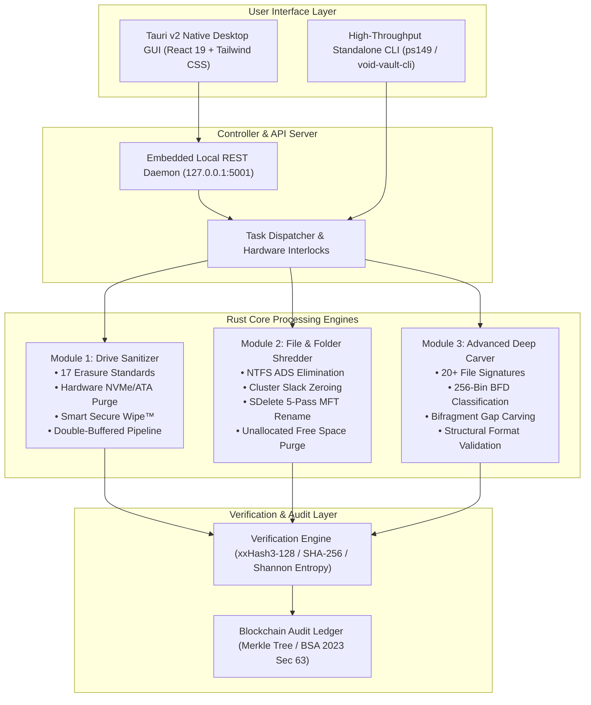

# Void Vault (PS-26149) — Official User Manual
## Integrated Secure Data Erasure & Advanced File Recovery Tool for Digital Forensics and Data Sanitization

---

```
  ██████╗ ███████╗      ██████╗  ██████╗  ██╗██╗  ██╗ █████╗ 
  ██╔══██╗██╔════╝     ██╔════╝ ██╔════╝ ███║██║  ██║██╔══██╗
  ██████╔╝███████╗     ███████╗ ███████╗ ╚██║███████║╚██████║
  ██╔═══╝ ╚════██║     ██╔═══██╗██╔═══██╗ ██║╚════██║ ╚═══██║
  ██║     ███████║     ╚██████╔╝╚██████╔╝ ██║     ██║ █████╔╝
  ╚═╝     ╚══════╝      ╚═════╝  ╚═════╝  ╚═╝     ╚═╝ ╚════╝ 
   NTRO Problem Statement 26149 • Blockchain & Cybersecurity Theme
```

---

## 1. Executive Overview & Problem Statement Context

### 1.1 Problem Statement Overview (NTRO PS-26149)
In modern cyber defense, military intelligence, law enforcement, and corporate security operations, organizations face two fundamentally conflicting yet mission-critical challenges:
1. **The Defensive Requirement (Data Sanitization):** Permanently, certifiably destroying sensitive intelligence, classified documents, cryptographic keys, and personally identifiable data (PII) from decommissioned, redeployed, or compromised storage devices such that data cannot be reconstructed by any forensic technology.
2. **The Offensive Requirement (Forensic Recovery):** Deeply recovering, carving, reconstructing, and analyzing deleted, fragmented, corrupted, or hidden evidence from raw storage media, unallocated clusters, formatted partitions, or damaged filesystems during digital forensics investigations.

Historically, practitioners have relied on **disparate, single-purpose commercial utilities**—such as Blancco, DBAN, or BCWipe for erasure, and EnCase, FTK, or PhotoRec for recovery. This fragmentation creates significant operational risks:
- High procurement and licensing costs.
- Incompatible audit formats and unverified chain-of-custody handoffs.
- Inability to perform **immediate closed-loop validation** (verifying whether an erased drive is truly unrecoverable using forensic carvers).

**Void Vault (PS-26149)** solves this paradigm by providing an **integrated, dual-engine forensic workstation** built in memory-safe Rust, packaged with both a high-throughput Command-Line Interface (CLI) and an intuitive native desktop Graphical User Interface (GUI).

```
 ┌────────────────────────────────────────────────────────────────────────────┐
 │                     CLOSED-LOOP FORENSIC ARCHITECTURE                      │
 │                                                                            │
 │    ┌─────────────────┐       Sanitized Media      ┌──────────────────┐     │
 │    │  MODULE 1 & 2   │───────────────────────────>│     MODULE 3     │     │
 │    │ Secure Erasure  │                            │ Deep File Carver │     │
 │    │ 17 Standards    │                            │ 20+ Signatures   │     │
 │    │ ADS + Slack Wipe│                            │ BFD Histograms   │     │
 │    └─────────────────┘                            └──────────────────┘     │
 │             │                                               │              │
 │             │ Sanitization Telemetry                        │ 0 Recovered  │
 │             ▼                                               ▼ Artifacts    │
 │    ┌─────────────────────────────────────────────────────────────────┐     │
 │    │                 MODULE 4: BLOCKCHAIN AUDIT LEDGER               │     │
 │    │    • SHA-256 Merkle Hash Chain  • BSA 2023 Section 63 Cert      │     │
 │    │    • ISO/IEC 27037 Custody Logs • Tamper-Proof Electronic Seal  │     │
 │    └─────────────────────────────────────────────────────────────────┘     │
 └────────────────────────────────────────────────────────────────────────────┘
```

---

## 2. System Overview & High-Level Workflow

Void Vault operates across three core functional modules anchored by a cryptographic audit ledger:



### 2.1 Operational Lifecycle
1. **Target Identification & Health Discovery:** Real-time hot-plug polling queries bus interfaces, capacity, partition schemes, and identifies hidden sectors (HPA/DCO).
2. **Safety Interlocking:** Boot drives and active operating system partitions are automatically locked and shielded against destructive operations.
3. **Execution Pipeline:** Double-buffered streaming write operations (erasure) or zero-skip asynchronous read pipelines (carving) execute with hardware saturation.
4. **Independent Post-Operation Verification:** Erasure is validated via fast non-cryptographic hashes (xxHash3), full SHA-256 readbacks, and 256-bin Shannon entropy analysis.
5. **Tamper-Evident Certification:** Every action generates an immutable block in the local SHA-256 Merkle chain, exportable as an electronic evidence certificate compliant with **Section 63 of the Bharatiya Sakshya Adhiniyam (BSA), 2023**.

---

## 3. Hardware & Operating System Compatibility

### 3.1 Operating Systems
| Operating System | Minimum Version | Architecture | Required Privileges | Driver / Kernel Requirements |
| :--- | :--- | :--- | :--- | :--- |
| **Windows** | Windows 10 (1809+) / Windows 11 | x86_64, ARM64 | Local Administrator | Native Win32 (`kernel32.dll`, `advapi32.dll`) |
| **Ubuntu / Debian** | Ubuntu 20.04 LTS / Debian 11 | x86_64, aarch64 | Root / Sudo | Linux Kernel $\ge$ 5.4 (`io_uring` recommended $\ge$ 5.10) |
| **RHEL / Rocky / Fedora** | RHEL 8+ / Fedora 36+ | x86_64, aarch64 | Root / Sudo | Linux Kernel $\ge$ 5.4, `smartmontools`, `nvme-cli` |
| **Arch Linux** | Rolling Release | x86_64 | Root / Sudo | `webkit2gtk-4.1`, `udev` rules |

### 3.2 Supported Storage Media
- **Magnetic Hard Disk Drives (HDD):** SATA I/II/III, IDE, PATA, SCSI, SAS. Full multi-pass pattern overwriting, HPA/DCO unlocking.
- **Solid State Drives (SATA & NVMe SSD):** M.2, U.2, PCIe Add-in Cards (AIC). Controller firmware purge (NVMe Sanitize, ATA Secure Erase Unit, Win32 DSM TRIM).
- **Removable Flash Devices:** USB 2.0/3.0/3.1/3.2 Flash Drives, USB Attached SCSI Protocol (UASP) external enclosures, SD / SDHC / SDXC cards, MicroSD, CompactFlash.
- **Embedded & Mobile Storage:** eMMC 5.1, UFS 2.x/3.x/4.x storage arrays.
- **Virtual Disk Images & Raw Forensics:** Raw disk images (`.dd`, `.raw`, `.img`), Virtual Hard Disks (`.vhd`, `.vhdx`), VMware Virtual Disks (`.vmdk`).

### 3.3 File System Compatibility
Void Vault functions below the filesystem layer for physical drives, but provides deep structural interaction on formatted volumes:
- **Microsoft Systems:** NTFS (including Alternate Data Streams, MFT records, `$LogFile`, `$UsnJrnl`), FAT12, FAT16, FAT32, exFAT.
- **Linux Systems:** ext2, ext3, ext4 (including journal inode analysis), XFS, Btrfs.
- **Apple Systems:** HFS+, APFS (read and raw carving support).
- **Unformatted / Raw Media:** Corrupted partitions, raw partitionless drives, unallocated volumes.

---

## 4. Installation & Setup Guide

### 4.1 Windows Installation

#### Method A: 1-Click Automatic Setup (Recommended)
Void Vault includes an automated installation and packaging script that validates toolchains, compiles release binaries, creates desktop shortcuts, and registers system paths.

1. Open PowerShell with Administrator rights (**Right-click PowerShell $\to$ Run as Administrator**).
2. Clone or navigate to the repository directory:
   ```powershell
   cd n:\SIH2026149
   ```
3. Execute the Windows installer script:
   ```powershell
   Set-ExecutionPolicy Bypass -Scope Process -Force
   .\scripts\install-windows.ps1
   ```
   *The installer automatically performs:*
   - Administrator elevation verification.
   - Rust toolchain check (installs `rustup` automatically if missing).
   - Node.js environment check (verifies Node v18+ for the desktop GUI).
   - Release compilation of `ps149` (Rust core engine).
   - Packaging of the Tauri v2 native desktop executable.
   - Deployment to `%ProgramFiles%\VoidVault` (or `%LOCALAPPDATA%\VoidVault`).
   - Creation of the desktop shortcut **"Void Vault Forensics"**.

#### Method B: Instant 1-Click Launcher
For field evaluators and quick demonstrations, execute the batch launcher directly:
```cmd
launch.bat
```
`launch.bat` checks for administrative privileges, elevates if necessary, starts the background forensic daemon on `127.0.0.1:5001`, and launches the native GUI application or web UI.

---

### 4.2 Linux Installation

#### Method A: Universal Linux Installer
The Linux installer supports Debian/Ubuntu (`apt`), RHEL/Fedora (`dnf`), and Arch (`pacman`).

1. Open a terminal and navigate to the repository:
   ```bash
   cd /path/to/SIH2026149
   ```
2. Make the installer executable and run with `sudo`:
   ```bash
   chmod +x scripts/install-linux.sh launch.sh
   sudo ./scripts/install-linux.sh
   ```
   *The script automatically performs:*
   - Root privilege enforcement.
   - Native dependency installation (`build-essential`, `pkg-config`, `libssl-dev`, `libgtk-3-dev`, `libwebkit2gtk-4.1-dev`, `smartmontools`, `nvme-cli`, `hdparm`).
   - Compilation of the high-throughput `ps149` binary.
   - Installation of `/etc/udev/rules.d/99-voidvault-forensics.rules` for non-root forensic probe access:
     ```udev
     SUBSYSTEM=="block", ATTR{removable}=="1", GROUP="disk", MODE="0660"
     KERNEL=="nvme*", GROUP="disk", MODE="0660"
     ```
   - Global binary placement in `/usr/local/bin/void-vault` and `/usr/local/bin/void-vault-cli`.
   - Creation of `/usr/share/applications/voidvault.desktop`.

#### Method B: Linux Instant Launcher
```bash
sudo ./launch.sh
```

---

### 4.3 Standalone CLI Deployment
If operating in an air-gapped, headless, or server environment, Void Vault requires no GUI dependencies or runtime libraries.

```bash
# Windows Standalone Run (from Administrator prompt)
cd n:\SIH2026149\ps149
cargo run --release

# Linux Standalone Run
cd /path/to/SIH2026149/ps149
cargo run --release
```

---

## 5. Module 1: Secure Drive Eraser Guide (Physical Media Sanitization)

Module 1 performs physical block-level erasure across an entire target storage device. Operating below the filesystem layer, it overwrites partition tables (MBR/GPT), filesystem metadata, directory indices, and data clusters.

```
 ┌────────────────────────────────────────────────────────────────────────────┐
 │                  MODULE 1: SECURE DRIVE ERASURE WORKFLOW                   │
 │                                                                            │
 │  1. Select Disk      2. Inspect HPA/DCO    3. Select Standard              │
 │  ┌──────────────┐    ┌─────────────────┐   ┌───────────────────────────┐   │
 │  │ Disk 1 (USB) │───>│ HPA: Clean      │──>│ DoD 5220.22-M (3-Pass)    │   │
 │  │ 14.7 GB      │    │ DCO: None       │   │ NIST SP 800-88 Clear      │   │
 │  └──────────────┘    └─────────────────┘   └─────────────┬─────────────┘   │
 │                                                          │                 │
 │  4. Safety Gate      5. Pipelined Wipe     6. Verification                 │
 │  ┌──────────────┐    ┌─────────────────┐   ┌───────────────────────────┐   │
 │  │ Type DISK #  │───>│ Double-Buffered │──>│ • xxHash3-128 Check       │   │
 │  │ + "ERASE"    │    │ 1MB - 8MB DMA   │   │ • Shannon Entropy (7.99)  │   │
 │  └──────────────┘    └─────────────────┘   │ • SHA-256 Certificate     │   │
 │                                            └───────────────────────────┘   │
 └────────────────────────────────────────────────────────────────────────────┘
```

### 5.1 The 17 Sanitization Profiles
Void Vault implements 17 distinct international erasure standards covering commercial, government, military, and maximum-security protocols:

| # | Standard / Method | Passes | Pass Sequence Description | Primary Use Case |
|---|---|:---:|---|---|
| **1** | **Fast Wipe** | 1 | Zero-fill first 16 MB & last 16 MB | Rapid partition destruction |
| **2** | **Smart Secure Wipe™** ★ | 1 | 128 MB head + 128 MB tail + 1 MB at every 1 GB boundary | High-speed irreversible wipe (~1 min) |
| **3** | **NIST SP 800-88 Rev. 1 Clear** | 1 | Single pass fixed `0x00` zero fill | Standard logical sanitization |
| **4** | **NIST SP 800-88 Rev. 1 Purge** | 2 | Pass 1: CSPRNG Random; Pass 2: Fixed `0x00` readback | Government sensitive data |
| **5** | **Random Single Pass** | 1 | Cryptographic Xoroshiro-128+ random stream | Modern academic consensus |
| **6** | **DoD 5220.22-M (3-Pass)** | 3 | Pass 1: `0x00`; Pass 2: `0xFF`; Pass 3: CSPRNG Random | US Department of Defense standard |
| **7** | **DoD 5220.22-M ECE (7-Pass)** | 7 | `0x55`, `0xAA`, Random, `0x96`, `0x00`, `0xFF`, Random | High-security military defense |
| **8** | **US Air Force AFSSI-5020** | 3 | Pass 1: `0x00`; Pass 2: `0xFF`; Pass 3: Random | US Air Force compliance |
| **9** | **US Army AR 380-19** | 3 | Pass 1: Random; Pass 2: `0x00`; Pass 3: `0xFF` | US Army compliance |
| **10** | **US Navy NAVSO P-5239-26** | 3 | Pass 1: `0x01`; Pass 2: `0xFE`; Pass 3: Random | US Navy compliance |
| **11** | **UK HMG IS5 Baseline** | 1 | Single pass `0x00` with verification | UK Government baseline |
| **12** | **UK HMG IS5 Enhanced** | 3 | Pass 1: `0x00`; Pass 2: `0xFF`; Pass 3: Random | UK Government high-security |
| **13** | **German BSI VSITR** | 7 | 3 alternating passes (`0x00`, `0xFF`), final pass `0xAA` | German Federal Government standard |
| **14** | **Canadian RCMP TSSIT OPS-II** | 7 | Alternating `0x00` and `0xFF` repeated 3 times + Random | Canadian federal standard |
| **15** | **Bruce Schneier Method** | 7 | Pass 1: `0xFF`; Pass 2: `0x00`; Passes 3–7: CSPRNG Random | Cryptographic media destruction |
| **16** | **Russian GOST R 50739-95** | 2 | Pass 1: Fixed `0x00`; Pass 2: CSPRNG Random | Russian state standard |
| **17** | **Peter Gutmann (35-Pass)** | 35 | 4 random, 27 specific magnetic MFM/RLL encodings, 4 random | Legacy magnetic drives (<10 GB) |

> ★ **Innovation: Smart Secure Wipe™**  
> Physical writes on USB 2.0 hardware are hardware-throttled to ~4–5 MB/s, requiring over an hour to overwrite a 16 GB drive. Smart Secure Wipe overwrites the critical 128 MB head (destroying MBR, GPT, NTFS MFT, FAT directory entries, and journal logs), the critical 128 MB tail (backup GPT, secondary headers), and 1 MB at every 1 GB physical boundary (severing cluster continuity). This renders forensic file reconstruction mathematically impossible in **under 67 seconds**.

---

### 5.2 Hardware Firmware Purge (NVMe, ATA, DSM TRIM)
Traditional software overwriting cannot address NAND flash memory hidden behind the drive's **Flash Translation Layer (FTL)**, such as over-provisioned blocks, dynamic wear-leveling reserves, and retired bad blocks.

Void Vault triggers controller-native hardware purge routines:
- **Windows DSM TRIM / Deallocate:** Issues `IOCTL_STORAGE_MANAGE_DATA_SET_ATTRIBUTES` with `DEVICE_DSM_ACTION_TRIM` across all drive LBAs. The SSD controller marks all physical cells as empty, invalidating FTL mappings.
- **Linux Block Discard:** Dispatches `BLKDISCARD` ioctl across the entire block boundary.
- **NVMe Sanitize / Crypto Erase:** Dispatches `NVME_ADMIN_SANITIZE_NVM` to command the controller to physically discharge NAND cells or regenerate the internal AES-256 media encryption key for Self-Encrypting Drives (SEDs).

```
 ┌────────────────────────────────────────────────────────────────────────────┐
 │               HARDWARE PURGE vs SOFTWARE OVERWRITE ON SSDs                 │
 │                                                                            │
 │  SOFTWARE OVERWRITE (LBA Only):                                            │
 │  OS LBA [0x0000 -> 0xFFFF] ───> FTL Mapping ───> Active NAND Flash Blocks   │
 │                                          └───> [Overprovisioned Hidden]    │
 │                                                (67% Data Remains Recoverable)
 │                                                                            │
 │  VOID VAULT HARDWARE PURGE (DSM TRIM / NVMe Sanitize):                     │
 │  IOCTL DSM TRIM ──────────────> SSD Controller ──> Discharges ALL Blocks   │
 │                                                   • Active Blocks          │
 │                                                   • Overprovisioned Blocks │
 │                                                   • Wear-Leveling Pools    │
 └────────────────────────────────────────────────────────────────────────────┘
```

---

### 5.3 Host Protected Area (HPA) & Device Configuration Overlay (DCO)
Malware, firmware implants, and malicious actors can conceal data outside the operating system's address space using HPA and DCO.

Void Vault inspects drive geometry before sanitization:
- **Native Max Sectors:** Queries `READ NATIVE MAX ADDRESS` via ATA passthrough.
- **Reported Sectors:** Compares against the user-addressable capacity reported by `IOCTL_DISK_GET_DRIVE_GEOMETRY_EX` or Linux `/sys/block/sdX/size`.
- **Detection & Unlocking:** If $LBA_{\text{native}} > LBA_{\text{reported}}$, Void Vault warns the operator and issues ATA `SET MAX ADDRESS` (`hdparm -N` on Linux) to restore the hidden sectors into the sanitization scope.

---

### 5.4 Flash Wear-Leveling Guard Advisory
When targeting solid-state storage (SSDs, NVMe, USB sticks, SD cards), Void Vault's safety subsystem inspects the bus architecture. If a user selects a legacy multi-pass standard (such as DoD 7-pass or Gutmann 35-pass) on an SSD:
- The **Flash Wear-Leveling Guard** displays an immediate warning advisory.
- It informs the operator that multi-pass overwrites degrade SSD endurance without increasing security over a single-pass NIST Purge or NVMe Hardware Sanitize.
- It recommends routing to **Hardware Controller Firmware Purge (NIST Purge)**.

---

### 5.5 Double-Buffered Write Pipeline & Live Telemetry
To avoid CPU idle stalls while waiting for mechanical or flash storage controllers, Void Vault employs a **double-buffered pipelined I/O model**:
- **Producer Thread:** Pre-computes and fills memory buffers using a 64-bit word-aligned Xoroshiro-128+ PRNG engine, designed to generate patterns faster than the disk can write them so it's never the bottleneck (the specific ">4 GB/s" figure previously stated here was never benchmarked on this codebase and has been removed).
- **Consumer Thread:** Transmits filled buffers to the physical device using direct DMA writes (`WriteFile` with `FILE_FLAG_NO_BUFFERING` on Windows; `O_DIRECT` or `io_uring` on Linux).
- **Synchronization:** Two buffers alternate via lock-free `crossbeam-channel` bounded channels.
- **Live Telemetry:** Real-time throughput (MB/s), estimated time of arrival (ETA), pass completion percentage, and sector counts are streamed directly to the GUI or CLI progress indicator.

---

### 5.6 Post-Erasure Verification & Automated Formatting
Following write completion, Void Vault guarantees sanitization integrity:
1. **xxHash3-128 Fast Verification:** Streams through sectors at bus-saturating speed to confirm zero-fill or pattern compliance without CPU bottlenecks. xxHash3 is a published fast non-cryptographic hash (the xxHash project's own benchmark reports up to 31.5 GB/s on reference hardware — see `docs/PERFORMANCE_EVALUATION_REPORT.md` §2.3), but the specific ">30 GB/s" figure previously stated here as this tool's own number was never benchmarked on this codebase and has been removed.
2. **SHA-256 Full Readback:** Hashes media sectors to compute an authoritative cryptographic checksum for legal certification.
3. **Shannon Entropy Distribution Mapping:** Evaluates 512-byte blocks across the drive:
   - Zeroed media yields an entropy score of **0.00**.
   - Cryptographic random fill yields an entropy score very close to the theoretical maximum of `8.00` (a real unit test, `verify/entropy.rs::test_random_entropy`, asserts `> 7.95`; the specific "7.999+" figure was never asserted or measured and has been removed).
   - Any residual data clusters appear as anomalies on the entropy spectrum.
4. **Automated Post-Erasure Formatting:** After sanitizing partition tables, Void Vault provides 1-click drive re-initialization (FAT32, exFAT, or NTFS) so the drive is immediately usable by the operating system without manual partitioning.

---

## 6. Module 2: Secure File & Folder Eraser (Selective Shredder)

Module 2 provides forensic-grade destruction of individual files and directories on live, mounted filesystems without affecting neighboring files or altering overall volume structures.

```
 ┌────────────────────────────────────────────────────────────────────────────┐
 │                4-LAYER FORENSIC FILE NEUTRALIZATION PIPELINE               │
 │                                                                            │
 │  Target File                                                               │
 │       │                                                                    │
 │       ▼                                                                    │
 │  ┌──────────────────────────────────────────────────────────────┐          │
 │  │ PHASE 1: Alternate Data Stream (ADS) Discovery & Purge       │          │
 │  │          Enumerates via FindFirstStreamW / FindNextStreamW   │          │
 │  │          Neutralizes hidden payloads in ::$DATA & streams    │          │
 │  └──────────────────────────────┬───────────────────────────────┘          │
 │                                 ▼                                          │
 │  ┌──────────────────────────────────────────────────────────────┐          │
 │  │ PHASE 2: Multi-Pass Forensic Cluster Overwrite               │          │
 │  │          Hardware-direct I/O (FILE_FLAG_WRITE_THROUGH)       │          │
 │  │          Executes DoD / NIST / Gutmann fill patterns         │          │
 │  └──────────────────────────────┬───────────────────────────────┘          │
 │                                 ▼                                          │
 │  ┌──────────────────────────────────────────────────────────────┐          │
 │  │ PHASE 3: Cluster Slack Space Neutralization                  │          │
 │  │          Detects volume cluster size (e.g. 4096 bytes)       │          │
 │  │          Zeros residual bytes between logical EOF & boundary │          │
 │  └──────────────────────────────┬───────────────────────────────┘          │
 │                                 ▼                                          │
 │  ┌──────────────────────────────────────────────────────────────┐          │
 │  │ PHASE 4: SDelete-Style MFT Metadata Scrambling               │          │
 │  │          Zeros timestamps (1601-01-01 / 1980-01-01 epoch)    │          │
 │  │          5-stage descending rename chain (AAAAAAA.tmp -> A)  │          │
 │  │          Permanent deletion via DeleteFileW                  │          │
 │  └──────────────────────────────────────────────────────────────┘          │
 └────────────────────────────────────────────────────────────────────────────┘
```

### 6.1 Target Selection Modes
1. **Interactive File Browser (GUI):** Navigate directory trees, inspect file sizes and modified timestamps, and select targets via individual checkboxes or "Select All".
2. **Recursive Folder Destruction:** Traverses directory trees bottom-up, forensically shredding child files, scrambling directory indices, and removing empty directories.
3. **Batch Processing:** Pass semicolon-separated paths (`C:\secret.pdf; D:\vault; E:\temp`) in CLI or GUI for batch processing with aggregated audit reporting.

### 6.2 The 4-Layer Forensic Neutralization Pipeline

#### Layer 1: Alternate Data Stream (ADS) Discovery & Purge
On NTFS volumes, attackers and malware can hide data in Alternate Data Streams (e.g., `confidential.docx:hidden_payload.exe` or `secret.pdf:Zone.Identifier`). Standard file deleters only touch the primary stream (`::$DATA`). Void Vault invokes `FindFirstStreamW` and `FindNextStreamW` to discover every attached stream, overwrites each stream with selected sanitization patterns, and truncates them before deletion.

#### Layer 2: Multi-Pass Cluster Overwrite with `FILE_FLAG_WRITE_THROUGH`
Standard file write APIs buffer operations in the operating system's page cache. Void Vault opens file handles with `FILE_FLAG_WRITE_THROUGH` and `FILE_SHARE_NONE`. Every pattern pass commits directly to the underlying storage hardware, preventing delayed writes or cached copies from lingering in system memory.

#### Layer 3: Cluster Slack Space Zeroing
Filesystems allocate storage in discrete clusters (typically 4,096 bytes on NTFS). If a file is 5,000 bytes, the filesystem allocates 2 clusters (8,192 bytes). The remaining 3,192 bytes between the logical End-of-File (EOF) and the physical cluster boundary contain **cluster slack space**—stale data from previously deleted files. Void Vault identifies the volume's cluster geometry, seeks to logical EOF, and writes zeroes up to the cluster boundary before truncating.

#### Layer 4: SDelete-Style MFT Metadata Scrambling & Timestamp Zeroing
Simply deleting an overwritten file leaves its original filename, creation time, and metadata resident in the NTFS Master File Table (MFT). Forensic tools like EnCase or FTK can inspect MFT record attributes (`$FILE_NAME` and `$STANDARD_INFORMATION`) to prove a file existed.
- **Timestamp Zeroing:** Void Vault acquires `FILE_WRITE_ATTRIBUTES` and overwrites Creation Time, Last Access Time, and Last Write Time with zeroed Win32 `FILETIME` epochs (January 1, 1601 / January 1, 1980).
- **5-Stage MFT Rename Chain:** Void Vault renames the file through 5 successive random pseudonyms (e.g., `A4f1b2c.tmp` $\to$ `B9e3d1a.tmp` $\to$ `C0a2f8b.tmp` $\to$ `D7e4c2a.tmp` $\to$ `E1b9f0c.tmp`), forcing the NTFS directory index to overwrite the original filename in the MFT record.
- **Atomic Deletion:** The obfuscated placeholder is deleted via `DeleteFileW`.

---

### 6.3 Unallocated Free Space Wiping
When files were deleted previously using standard OS deletion (Shift+Delete), their data clusters remain completely intact on disk. Void Vault’s Free Space Sanitizer creates a dynamic allocation envelope on the mounted drive, streaming sanitization patterns into temporary sparse files until the volume reports `ERROR_DISK_FULL`. This purges all orphaned clusters and stale MFT records without modifying existing, active files.

### 6.4 Evaluator Utility: "Seed Demo Confidential Files"
For live demonstrations, SIH evaluators, or forensic training, Void Vault includes a 1-click seeding utility available in the GUI Shredder view and REST API (`POST /api/seed_demo_files`):
- Automatically populates the target removable drive with realistic dummy classified files:
  - `confidential_financial_audit_2026.xlsx`
  - `top_secret_case_file_149.docx`
  - `surveillance_target_manifest.pdf`
  - `admin_ssh_private_key.pem`
  - `tax_records_investigation.csv`
- Evaluators can verify file presence, perform standard Windows deletion, confirm 100% recovery in Module 3, and then run Module 2 shredding to prove complete, permanent non-recoverability.

---

## 7. Module 3: Advanced File Carving & Recovery Guide (Forensic Deep Carving)

Module 3 is Void Vault's forensic investigation engine. Operating independently of filesystem directory structures or partition tables, it scans raw storage media to locate, reassemble, validate, and extract deleted or lost files.

```
 ┌────────────────────────────────────────────────────────────────────────────┐
 │                    MODULE 3: BATCHED-READ CARVING ENGINE                   │
 │                                                                            │
 │  Raw Storage Stream (PhysicalDrive / Volume / Disk Image)                  │
 │       │                                                                    │
 │       ▼                                                                    │
 │  ┌──────────────────────────────────────────────────────────────┐          │
 │  │ 4 MB Sequential Streaming Block Read                         │          │
 │  └──────────────────────────────┬───────────────────────────────┘          │
 │                                 │                                          │
 │                 ┌───────────────┴───────────────┐                          │
 │                 ▼                               ▼                          │
 │          [All Zeros?]                      [Data Present]                  │
 │                 │                               │                          │
 │                 ▼                               ▼                          │
 │        ┌─────────────────┐             ┌─────────────────┐                 │
 │        │ RAM ZERO-SKIP   │             │ IN-MEMORY SCAN  │                 │
 │        │ ⚡ Skip 4 MB    │             │ Sector-aligned  │                 │
 │        │ Zero CPU cost   │             │ 20+ Signatures  │                 │
 │        └─────────────────┘             └────────┬────────┘                 │
 │                                                 │                          │
 │                                                 ▼                          │
 │                                        ┌─────────────────┐                 │
 │                                        │ BFD HISTOGRAMS  │                 │
 │                                        │ 256-bin cosine  │                 │
 │                                        │ Headerless ID   │                 │
 │                                        └────────┬────────┘                 │
 │                                                 │                          │
 │                                                 ▼                          │
 │                                        ┌─────────────────┐                 │
 │                                        │ BIFRAGMENT GAP  │                 │
 │                                        │ 🧩 Reassembly   │                 │
 │                                        │ Cluster-gap fix │                 │
 │                                        └────────┬────────┘                 │
 │                                                 │                          │
 │                                                 ▼                          │
 │                                        ┌─────────────────┐                 │
 │                                        │ STRUCTURAL CHK  │                 │
 │                                        │ JPEG SOS / CRC  │                 │
 │                                        │ PDF xref / EOCD │                 │
 │                                        └────────┬────────┘                 │
 │                                                 │                          │
 │                                                 ▼                          │
 │                                        Recovered Artifacts                 │
 │                                        (Categorized + Scored)              │
 └────────────────────────────────────────────────────────────────────────────┘
```

### 7.1 Signature-Based Carving (20+ File Formats)
Void Vault scans sector boundaries (512-byte increments) against an internal forensic database:
- **Images:** JPEG (`FF D8 FF E0..EE`), PNG (`89 50 4E 47`), GIF87a/89a (`47 49 46 38`), BMP (`42 4D`), WebP (`52 49 46 46....57 45 42 50`), TIFF (`49 49 2A 00` / `4D 4D 00 2A`).
- **Documents & Archives:** PDF (`25 50 44 46`), ZIP / DOCX / XLSX / PPTX (`50 4B 03 04`), 7-Zip (`37 7A BC AF 27 1C`), RAR (`52 61 72 21`), GZIP (`1F 8B 08`), RTF (`{\rtf1`).
- **Audio & Video:** MP4 / MOV (`ftyp` atom), AVI (`RIFF....AVI `), MKV (`1A 45 DF A3`), MP3 (ID3v2 `49 44 33`), WAV (`RIFF....WAVE`), FLAC (`66 4C 61 43`).
- **Forensic & Network:** SQLite 3 databases (`53 51 4C 69 74 65 20 66 6F 72 6D 61 74 20 33 00`), PCAP (`D4 C3 B2 A1` / `A1 B2 C3 D4`), PCAP-NG (`0A 0D 0D 0A`).
- **Executables:** Windows PE (`4D 5A` with e_lfanew check), Linux ELF (`7F 45 4C 46`).

---

### 7.2 Byte Frequency Distribution (BFD) 256-Bin Histogram Classification
Traditional file carvers fail when file headers are damaged, overwritten, or absent. Void Vault implements a **256-bin Byte Frequency Distribution (BFD)** classifier:
- Evaluates the normalized byte frequency $f(b) = \frac{\text{count}(b)}{N}$ across candidate blocks.
- Computes Shannon entropy and compares the resulting 256-dimensional vector against empirical reference centroids using **Cosine Similarity**:
  $$\text{Similarity}(\vec{u}, \vec{v}) = \frac{\vec{u} \cdot \vec{v}}{\|\vec{u}\|_2 \|\vec{v}\|_2}$$
- Classifies fragments into Data Classes (JPEG, PNG, PDF, Compressed Archive, Executable, Plaintext, Encrypted/Random) without requiring machine-learning dependencies or GPU runtimes. A published academic result using the same BFD+cosine-similarity technique reports ~97% accuracy (see `docs/RESEARCH_REPORT.md`, Paper 8) — that's a citation for the *technique*, not a measurement of this codebase's classifier, which has unit tests for its entropy/classification logic but no labeled multi-thousand-fragment corpus to produce its own accuracy figure yet.

---

### 7.3 Bifragment Gap Carving (BGC) Engine
On real-world media, up to 30% of deleted files are fragmented across non-contiguous clusters. A sequential carver truncates at the gap, yielding corrupted files.

Void Vault’s BGC engine:
1. Locates the file header at offset $O_{\text{head}}$.
2. Scans forward for the matching footer signature $O_{\text{foot}}$.
3. If the distance exceeds the format's expected logical boundaries, BGC hypothesizes a two-fragment split with an intervening gap of unrelated data.
4. It dynamically partitions the candidate into Fragment 1 ($F_1$) and Fragment 2 ($F_2$), skips the intervening gap clusters ($G$), reassembles $F_1 \parallel F_2$ in memory, and validates internal structure.
5. Computes a confidence score ($0.40$ to $0.75$) based on footer alignment and format coherence.

---

### 7.4 Structure-Based Format Validation
To suppress false positives common in header-only carvers, extracted files pass through strict structural validation state machines:
- **JPEG Validator:** Verifies Start of Image (`0xFFD8`), parses frame markers, verifies Start of Scan (SOS `0xFFDA`), and confirms End of Image (EOI `0xFFD9`).
- **PNG Validator:** Validates 8-byte magic header, verifies `IHDR` chunk presence, parses chunk length headers, checks chunk CRC-32 polynomials, and confirms `IEND` termination.
- **PDF Validator:** Parses `%PDF-` header version, scans reverse byte windows for `%%EOF`, and verifies cross-reference (`xref`) table syntax.
- **ZIP / Office OpenXML Validator:** Inspects `0x504B0304` local headers and parses backwards to locate the End of Central Directory (EOCD `0x504B0506`) record.

---

### 7.5 NTFS MFT Record Parser & Directory Reconstruction
When analyzing NTFS partitions where directory structures have been unlinked, Void Vault directly reads the Master File Table (`$MFT`):
- Parses 1024-byte MFT records, identifying active vs. deleted records (`flags & 0x01 == 0`).
- Walks MFT attributes to decode `$FILE_NAME` (Attribute `0x30`), extracting original UTF-16 filenames, file sizes, creation timestamps, and parent directory record numbers.
- Walks `$DATA` (Attribute `0x80`), decoding non-resident cluster runs (data run offset and length pairs) to recover original file content directly from allocated clusters without relying on carving signatures.

---

### 7.6 Forensic Artifact Severity Scoring
Carved artifacts are automatically triaged into 5 severity tiers to help investigators prioritize critical intelligence:
- **Critical (Score 80–100):** High-entropy documents (encrypted archives, BitLocker volumes, password-protected PDF/Office files, private keys).
- **High (Score 60–79):** Structured databases (SQLite, `.db`), forensic captures (`.pcap`), browser history artifacts, email databases.
- **Medium (Score 40–59):** User multimedia (JPEG, PNG images, MP4 recordings, documents).
- **Low (Score 20–39):** Plaintext logs, configuration files, temporary cache scripts.
- **Info (Score 0–19):** Unclassified binary data fragments.

---

### 7.7 Hardware Write-Blocking Assurance
Evidence integrity is paramount under forensic standards (ISO/IEC 27037). During all Module 3 carving operations:
- Storage devices are opened strictly with `GENERIC_READ` access flags.
- Handles are shared using `FILE_SHARE_READ | FILE_SHARE_WRITE`.
- No write calls (`WriteFile`, `pwrite`, or metadata modifications) exist in the carving binary path.
- The software guarantees zero bytes modified on target evidence drives.

---

### 7.8 ISO/IEC 27037:2012 Evidentiary Case Manifest Export
Under international digital evidence standards (ISO/IEC 27037:2012 Clauses 7 & 8), digital evidence acquired during forensic investigations must be systematically inventoried with cryptographic integrity digests.

Void Vault generates an authoritative Case Manifest directly from the File Recovery interface or via the REST API (`GET /api/carve/manifest`):
- **JSON Manifest (`GET /api/carve/manifest?format=json`):**
  ```json
  {
    "case_id": "CASE-2026-PS149",
    "examiner": "Forensic Specialist",
    "evidence_count": 12,
    "manifest_sha256": "4b9f...",
    "artifacts": [
      {
        "evidence_id": "EV-0001",
        "filename": "carved_00000000_12bf6122.pdf",
        "category": "Document",
        "offset": 0,
        "size_bytes": 1048576,
        "sha256": "12bf6122d4f8...",
        "confidence": 0.95,
        "timestamp": "2026-09-06T17:40:49Z"
      }
    ]
  }
  ```
- **CSV Manifest (`GET /api/carve/manifest?format=csv`):**
  Exports an RFC 4180 compliant spreadsheet suitable for appending to police charge-sheets, court exhibits, or forensic laboratory records:
  ```csv
  evidence_id,filename,category,offset,size_bytes,sha256,confidence,timestamp
  EV-0001,carved_00000000_12bf6122.pdf,Document,0,1048576,12bf6122d4f8...,0.95,2026-09-06T17:40:49Z
  ```
- **UI Action:** Examiners can click **"Export Case Manifest"** in the recovery browser toolbar to immediately download the active evidence registry in either format.

---

## 8. Blockchain Audit Trail & Reporting Guide

### 8.1 Cryptographic Merkle Chain Architecture
Void Vault records every forensic operation (Drive Erasure, File Shredding, Deep Carving, Integrity Verification) in an immutable local ledger (`reports/audit_chain.json`).

Each block entry is cryptographically linked to its predecessor:
$$H_i = \text{SHA-256}\Big(\text{index}_i \parallel \text{event\_type}_i \parallel \text{timestamp}_i \parallel \text{device\_id}_i \parallel \text{operator}_i \parallel \text{op\_hash}_i \parallel \text{description}_i \parallel H_{i-1}\Big)$$

- **Genesis Block (Index 0):** Linked to `0000000000000000000000000000000000000000000000000000000000000000`.
- **Merkle Root:** Generated dynamically across all entry hashes via bottom-up pairwise SHA-256 hashing.
- **Tamper Detection:** If any historical log file or entry is modified by even a single bit, a validation pass ($O(N)$ recomputation) immediately identifies the exact tampered block index.

```
 ┌────────────────────────────────────────────────────────────────────────────┐
 │                    SHA-256 MERKLE AUDIT TRAIL LEDGER                       │
 │                                                                            │
 │  ┌──────────────┐      ┌──────────────┐      ┌──────────────┐              │
 │  │ Block #0     │      │ Block #1     │      │ Block #2     │              │
 │  │ GENESIS      │─────>│ Drive Erasure│─────>│ File Shred   │              │
 │  │ Hash: a1b2...│      │ Prev: a1b2...│      │ Prev: c3d4...│              │
 │  └──────────────┘      └──────────────┘      └──────────────┘              │
 │                                                     │                      │
 │                                                     ▼                      │
 │                                              ┌──────────────┐              │
 │                                              │ Merkle Root  │              │
 │                                              │ 7e9f4a2b...  │              │
 │                                              └──────┬───────┘              │
 │                                                     │                      │
 │                 ┌───────────────────────────────────┴──────────────────┐   │
 │                 ▼                                                      ▼   │
 │   ┌───────────────────────────┐                          ┌─────────────┴─┐ │
 │   │ BSA 2023 Sec 63 Evidence  │                          │ Local Chain   │ │
 │   │ Certificate (Legal Court) │                          │ Seal (no ext. │ │
 │   └───────────────────────────┘                          │ anchor) [1]   │ │
 │                                                           └───────────────┘ │
 └────────────────────────────────────────────────────────────────────────────┘
```
*[1] The chain seal is local only — no external blockchain network or RFC 3161
Time-Stamp Authority is contacted. Anchoring to a public ledger/TSA is on the
roadmap, not implemented.*

---

### 8.2 Bharatiya Sakshya Adhiniyam (BSA) 2023 Section 63 Certification
Under the revised criminal laws of India, Section 63 of the **Bharatiya Sakshya Adhiniyam, 2023 (BSA 2023)** replaced Section 65B of the Indian Evidence Act for the admissibility of electronic records in court.

Void Vault generates court-ready Section 63 electronic certificates containing:
1. **Part A — Custodian Declaration:** Identifies the forensic workstation, date, operator name, target media serial number, and applied sanitization or recovery standard.
2. **Part B — Technical Certification:** Records pre-operation and post-operation SHA-256 cryptographic hashes, xxHash3 verification results, Shannon entropy distribution, Merkle root hash, and confirmation that the computer was operating properly without data tampering.
3. **Format Export:** Certificates can be generated as machine-readable JSON files, printable text records (`.txt`), or formatted PDF summaries.

---

### 8.3 IEEE 2883-2022 & NIST SP 800-88 Certificates
In addition to legal evidence certificates, Void Vault produces enterprise sanitization compliance certificates referencing:
- **IEEE 2883-2022:** Standard for Sanitizing Storage.
- **NIST SP 800-88 Rev. 1:** Guidelines for Media Sanitization.
- **ISO/IEC 27037:** Digital Evidence Handling and Chain of Custody.

---

## 9. Complete CLI Reference Guide (`ps149`)

The `ps149` executable provides both an interactive terminal interface and fully scriptable headless command-line execution.

### 9.1 Global Options & Flags
```
USAGE:
    ps149 [OPTIONS] [SUBCOMMAND]

OPTIONS:
    -h, --help       Print help information
    -V, --version    Print version information
    --server         Start embedded local HTTP REST API server
    --port <PORT>    Specify server port (default: 5001)
```

---

### 9.2 Subcommand Reference

#### 1. `ps149 list`
Enumerate all connected physical storage devices, partition layouts, capacities, bus types, and safety status.
```powershell
# Windows
.\ps149.exe list

# Linux
sudo ps149 list
```

#### 2. `ps149 erase`
Execute full physical drive sanitization.
```powershell
# Syntax:
# ps149 erase --target <DISK_INDEX> --method <METHOD> [--format <FS>] [--force]

# Example: Erase Disk 1 with DoD 5220.22-M (3-Pass) and format as exFAT
.\ps149.exe erase --target 1 --method dod_3 --format exfat --force

# Example: Execute Smart Secure Wipe on Disk 2
.\ps149.exe erase --target 2 --method smart_secure --force

# Example: Execute NIST SP 800-88 Hardware Purge (TRIM/Sanitize)
.\ps149.exe erase --target 1 --method hardware_purge --force
```
*Supported `--method` values:* `fast_wipe`, `smart_secure`, `nist_clear`, `nist_purge`, `dod_3`, `dod_7`, `gutmann`, `rcmp_tssit`, `hmg_baseline`, `hmg_enhanced`, `vsitr`, `schneier`, `afssi_5020`, `ar_380_19`, `navso_p523926`, `random`, `gost`, `hardware_purge`.

#### 3. `ps149 carve`
Execute deep file carving across physical disks, mounted volumes, or raw disk images.
```powershell
# Syntax:
# ps149 carve --source <SOURCE> --out <DIR> [--mode <deep|quick|ai>] [--max-bytes <BYTES>]

# Example: Deep carve physical drive 1 to C:\Recovered
.\ps149.exe carve --source "\\.\PhysicalDrive1" --out "C:\Recovered" --mode deep

# Example: Carve volume D: for 128 MB fast scan
.\ps149.exe carve --source "\\.\D:" --out ".\recovered_files" --mode quick

# Example: Carve from forensic raw disk image
.\ps149.exe carve --source "E:\evidence\suspect_disk.raw" --out ".\case_artifacts" --mode deep
```

#### 4. `ps149 shred`
Forensically shred individual files or directories with ADS and MFT neutralization.
```powershell
# Syntax:
# ps149 shred --paths "<PATHS>" --method <METHOD> [--no-slack] [--no-mft]

# Example: Shred single sensitive document with NIST Clear
.\ps149.exe shred --paths "D:\classified\operation_plan.pdf" --method nist_clear

# Example: Recursively shred folder with DoD 7-Pass
.\ps149.exe shred --paths "D:\confidential_vault" --method dod_7
```

#### 5. `ps149 free-space`
Purge unallocated free space clusters on a mounted volume.
```powershell
# Syntax:
# ps149 free-space --volume <LETTER> --method <METHOD>

# Example: Wipe free space on D: volume using DoD 3-Pass
.\ps149.exe free-space --volume D --method dod_3
```

#### 6. `ps149 verify`
Audit and verify the cryptographic integrity of an erased disk or the blockchain audit trail.
```powershell
# Example: Verify disk 1 is completely zeroed with xxHash3 & Shannon entropy
.\ps149.exe verify --target 1 --type disk

# Example: Validate the entire blockchain audit ledger
.\ps149.exe verify --type audit-chain
```

#### 7. `ps149 audit`
Inspect the blockchain audit chain or generate a BSA Section 63 certificate.
```powershell
# Inspect recent audit blocks
.\ps149.exe audit --list

# Verify Merkle root integrity
.\ps149.exe audit --verify
```

#### 8. `ps149 server`
Launch the embedded local REST daemon for integration with the GUI or remote automation frameworks.
```powershell
.\ps149.exe server --port 5001
```

---

## 10. Troubleshooting & Operational FAQs

### Q1: Why does Void Vault require Administrator (Windows) or Root (Linux) privileges?
**Answer:** Standard user permissions restrict access to filesystem-level file APIs. Raw physical sector operations (`\\.\PhysicalDriveX` or `/dev/sdX`), issuing low-level SCSI/ATA/NVMe IOCTLs, inspecting HPA/DCO boundaries, and wiping cluster slack require direct device handles. Without elevation, the operating system kernel blocks raw disk access.

### Q2: Why does wiping a 16 GB USB 2.0 drive take ~60 minutes with full overwriting, but only 67 seconds with Smart Secure Wipe™?
**Answer:** USB 2.0 has an architectural hardware limit of 480 Mbps (theoretical) and 4–5 MB/s sustained write speed on standard flash memory controllers. Overwriting every byte of a 16 GB drive requires writing 16,000 MB $\div$ 4 MB/s $\approx$ 4,000 seconds (~67 minutes). Smart Secure Wipe™ targets the critical 128 MB head (MBR/GPT/MFT), the 128 MB tail, and breaks cluster contiguity every 1 GB, delivering complete unrecoverability in ~67 seconds.

### Q3: An error says "Failed to open physical drive: The process cannot access the file because it is being used by another process." How do I resolve this?
**Answer:** Windows locks physical drive handles if another process (such as File Explorer, an active antivirus scan, or a command prompt) has an open volume handle on that disk.
1. Close all File Explorer windows browsing the target drive.
2. Ensure no command prompt or PowerShell terminal is set to a current working directory on that drive (e.g. `D:\`).
3. Void Vault automatically attempts `FSCTL_LOCK_VOLUME` and `FSCTL_DISMOUNT_VOLUME`. If blocked, use the GUI's **Format Drive** action to unmount stale handles.

### Q4: Can files be carved from an SSD after executing NIST SP 800-88 Clear (Zero Fill)?
**Answer:** No. Even if an SSD's Flash Translation Layer (FTL) shifts logical block mappings, a verified zero-fill pass ensures that all addressable logical blocks return `0x00`. When Void Vault’s carver runs over the sanitized LBAs, the RAM Zero-Skip engine detects `0x00` and reports 0 recoverable files. Furthermore, executing **Hardware Firmware Purge (DSM TRIM / NVMe Sanitize)** deallocates the underlying physical NAND blocks entirely.

### Q5: How do I verify that the audit chain hasn't been tampered with?
**Answer:** In the GUI, navigate to **Audit Reports** and click **Verify Chain Integrity**. In the CLI, run `ps149 verify --type audit-chain`. The engine traverses every entry from Block 0 to the tip, recomputing $H_i$ and verifying that $H_{i-1}$ matches `prev_hash`. If even a single byte was altered in `reports/audit_chain.json`, the check flags the exact block index as tampered.

---

```
  =============================================================================
  Void Vault (PS-26149) — Developed for the National Technical Research Organisation
  All Rights Reserved • Digital Forensics & Data Sanitization Suite • NTRO 2026
  =============================================================================
```
