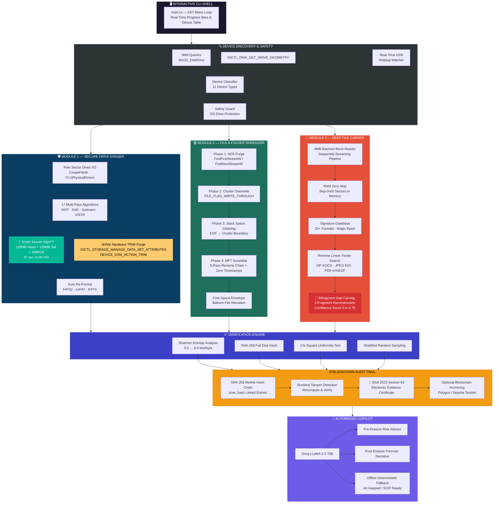
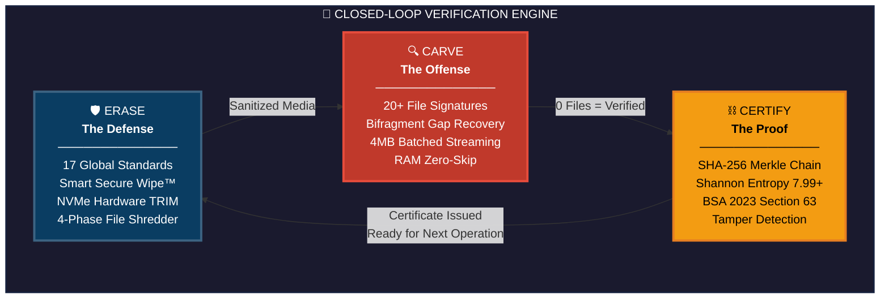

# 📐 System Architecture & Forensic Pipeline Diagrams — PS-26149

This directory contains the complete set of native **Mermaid UML diagrams** for **PS-26149 (National Technical Research Organisation — NTRO)**. All diagrams render directly on GitHub and can be exported for SIH presentation slide decks.

---

## 📑 Diagram Catalog

| Diagram File | Category | Description | Primary Slide Placement |
| :--- | :--- | :--- | :---: |
| **[system-architecture.md](./system-architecture.md)** | System Design | Layered architecture showing all 3 core modules, kernel I/O, verification, blockchain, and AI layers | **Slide 3 (Technical Approach)** |
| **[closed-loop-flow.md](./closed-loop-flow.md)** | Core Concept | The closed-loop verification cycle (Erase $\to$ Carve $\to$ Certify) contrasted with traditional tools | **Slide 2 (Proposed Solution)** |
| **[shredder-pipeline.md](./shredder-pipeline.md)** | Anti-Forensics | 4-Phase forensic file shredding pipeline (ADS $\to$ Overwrite $\to$ Slack $\to$ MFT) | **Slide 3 (Technical Approach)** |
| **[battle-demo-and-internals.md](./battle-demo-and-internals.md)** | Live Demo & Algorithms | Sequence diagram of the 60s Live Battle Demo, batched-read Carver acceleration pipeline, and Merkle Hash Chain | **Slides 3, 4, 6** |

---

## 1. System Architecture Overview

---

## 2. The Closed-Loop Verification Principle

---

## 3. How to Use in Presentations

1. **GitHub Native Render:** Viewing these markdown files directly on GitHub renders the diagrams automatically in high resolution.
2. **Export to PNG/SVG:** You can paste the code into [mermaid.live](https://mermaid.live) to download high-resolution PNG or SVG assets for your official SIH presentation slides.
