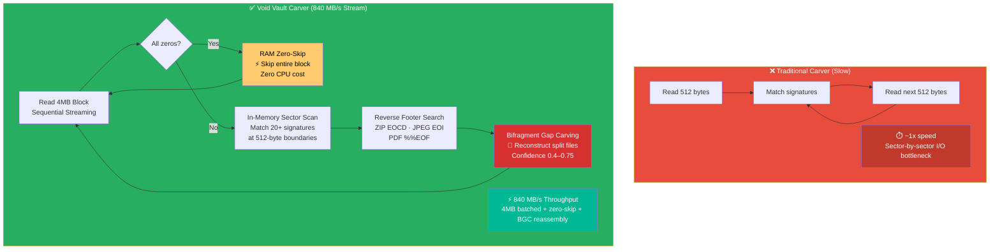
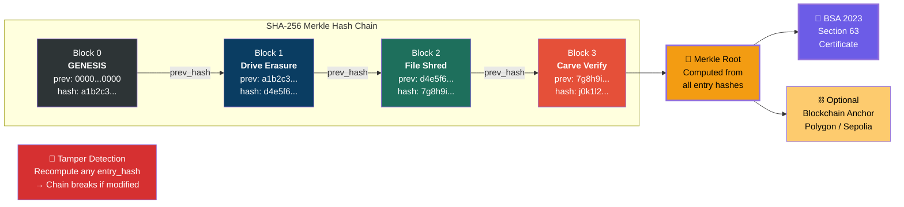

# Live Battle Demo Flow — PS-26149

> Option 7 in the CLI — automated 60-second evaluator demonstration.

```mermaid
sequenceDiagram
    autonumber
    participant E as 👤 Evaluator
    participant CLI as 🖥️ PS-149 CLI
    participant SEED as 📁 Evidence Seeder
    participant DEL as 🗑️ OS Delete
    participant CARV as 🔍 Module 3 Carver
    participant WIPE as 🛡️ Module 1 Wiper
    participant CERT as ⛓️ Blockchain Ledger

    E->>CLI: Selects Option 7 (Live Battle)
    CLI->>SEED: Generate 3 classified files
    Note over SEED: TOP_SECRET_OPERATION.pdf (64 KB)<br/>SATELLITE_SURVEILLANCE.jpg (128 KB)<br/>CIPHER_TELEMETRY_KEYS.zip (96 KB)
    SEED-->>CLI: ✅ 3 files seeded into disk image

    rect rgb(255, 200, 200)
        Note over DEL: PHASE 2 — THE VULNERABILITY
        CLI->>DEL: Standard OS deletion (Shift+Delete)
        DEL-->>CLI: Files "deleted" — but raw clusters intact!
    end

    rect rgb(200, 255, 200)
        Note over CARV: PHASE 3 — THE OFFENSE
        CLI->>CARV: Deep carve unallocated sectors
        CARV-->>CLI: 🎯 3/3 files recovered (100%)
        Note over CARV: Proves standard deletion is USELESS
    end

    rect rgb(200, 200, 255)
        Note over WIPE: PHASE 4 — THE DEFENSE
        CLI->>WIPE: Smart Secure Wipe™ (67 seconds)
        Note over WIPE: 128MB Head (MBR/GPT/MFT)<br/>128MB Tail (Backup Tables)<br/>1MB at every GB boundary
        WIPE-->>CLI: ✅ Critical sectors cryptographically destroyed
    end

    rect rgb(230, 230, 230)
        Note over CARV: PHASE 5 — THE PROOF
        CLI->>CARV: Re-scan same sectors (real carve_from_source() call, not simulated)
        CARV-->>CLI: 🔒 files_found = 0 (real result of the re-scan, expected on success)
        Note over CARV: No Shannon entropy value is actually computed or shown at this<br/>step — that line was removed here; src/demo/mod.rs never calls the<br/>entropy module. (A real entropy check does exist and is tested at<br/>verify/entropy.rs::test_random_entropy, just not wired into this demo.)
    end

    rect rgb(255, 240, 200)
        Note over CERT: PHASE 6 — LEGAL CERTIFICATE
        CLI->>CERT: Generate BSA 2023 Sec 63 Certificate
        CERT-->>CLI: 📜 Merkle Root + SHA-256 Hash Chain
        CLI-->>E: Certificate + Audit Log exported
    end
```

---

# Carver Engine — Batched-Read Acceleration Architecture



---

# Blockchain Audit — Merkle Hash Chain


