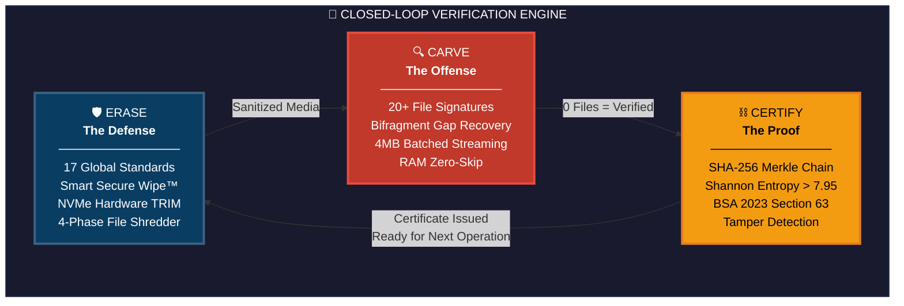
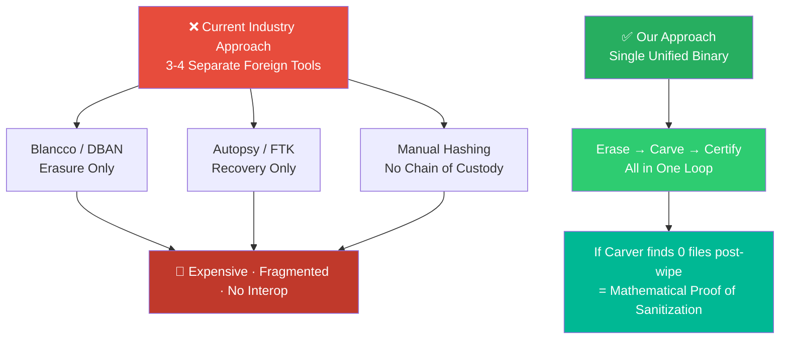

# Closed-Loop Verification Flow — PS-26149

> The core USP: Erasure, Carving, and Certification form a self-verifying feedback loop.

```mermaid
graph LR
    subgraph LOOP["🔄 CLOSED-LOOP VERIFICATION ENGINE"]
        direction LR
        ERASE["🛡️ ERASE<br/><b>The Defense</b><br/>──────────────<br/>17 Global Standards<br/>Smart Secure Wipe™<br/>NVMe Hardware TRIM<br/>4-Phase File Shredder"]
        CARVE["🔍 CARVE<br/><b>The Offense</b><br/>──────────────<br/>20+ File Signatures<br/>Bifragment Gap Recovery<br/>4MB Batched Streaming<br/>RAM Zero-Skip"]
        CERTIFY["⛓️ CERTIFY<br/><b>The Proof</b><br/>──────────────<br/>SHA-256 Merkle Chain<br/>Shannon Entropy > 7.95<br/>BSA 2023 Section 63<br/>Tamper Detection"]
    end

    ERASE -->|"Sanitized Media"| CARVE
    CARVE -->|"0 Files = Verified"| CERTIFY
    CERTIFY -->|"Certificate Issued<br/>Ready for Next Operation"| ERASE

    style ERASE fill:#0a3d62,color:#fff,stroke:#3c6382,stroke-width:3px
    style CARVE fill:#c0392b,color:#fff,stroke:#e74c3c,stroke-width:3px
    style CERTIFY fill:#f39c12,color:#000,stroke:#e67e22,stroke-width:3px
    style LOOP fill:#1a1a2e,color:#fff,stroke:#16213e,stroke-width:2px
```

### Why this matters (for evaluators):

```mermaid
graph TD
    PROBLEM["❌ Current Industry Approach<br/>3-4 Separate Foreign Tools"]
    TOOL1["Blancco / DBAN<br/>Erasure Only"]
    TOOL2["Autopsy / FTK<br/>Recovery Only"]
    TOOL3["Manual Hashing<br/>No Chain of Custody"]
    COST["💸 Expensive · Fragmented · No Interop"]

    OUR["✅ Our Approach<br/>Single Unified Binary"]
    UNIFIED["Erase → Carve → Certify<br/>All in One Loop"]
    PROOF["If Carver finds 0 files post-wipe<br/>= Mathematical Proof of Sanitization"]

    PROBLEM --> TOOL1 & TOOL2 & TOOL3
    TOOL1 & TOOL2 & TOOL3 --> COST

    OUR --> UNIFIED --> PROOF

    style PROBLEM fill:#e74c3c,color:#fff
    style COST fill:#c0392b,color:#fff
    style OUR fill:#27ae60,color:#fff
    style UNIFIED fill:#2ecc71,color:#fff
    style PROOF fill:#00b894,color:#fff
```
