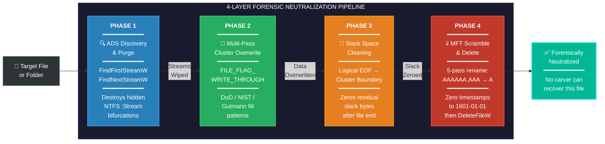

# 4-Phase Forensic File Shredder Pipeline — PS-26149

> Module 2 shreds files through 4 sequential anti-forensic phases.

```mermaid
graph LR
    INPUT["📄 Target File<br/>or Folder"] --> P1

    subgraph PIPELINE["4-LAYER FORENSIC NEUTRALIZATION PIPELINE"]
        direction LR
        P1["<b>PHASE 1</b><br/>━━━━━━━━━━━<br/>🔍 ADS Discovery<br/>& Purge<br/>━━━━━━━━━━━<br/>FindFirstStreamW<br/>FindNextStreamW<br/>━━━━━━━━━━━<br/>Destroys hidden<br/>NTFS :Stream<br/>bifurcations"]
        P2["<b>PHASE 2</b><br/>━━━━━━━━━━━<br/>📝 Multi-Pass<br/>Cluster Overwrite<br/>━━━━━━━━━━━<br/>FILE_FLAG_<br/>WRITE_THROUGH<br/>━━━━━━━━━━━<br/>DoD / NIST /<br/>Gutmann fill<br/>patterns"]
        P3["<b>PHASE 3</b><br/>━━━━━━━━━━━<br/>🧹 Slack Space<br/>Cleaning<br/>━━━━━━━━━━━<br/>Logical EOF →<br/>Cluster Boundary<br/>━━━━━━━━━━━<br/>Zeros residual<br/>slack bytes<br/>after file end"]
        P4["<b>PHASE 4</b><br/>━━━━━━━━━━━<br/>💀 MFT Scramble<br/>& Delete<br/>━━━━━━━━━━━<br/>5-pass rename:<br/>AAAAAA.AAA → A<br/>━━━━━━━━━━━<br/>Zero timestamps<br/>to 1601-01-01<br/>then DeleteFileW"]
    end

    P1 -->|"Streams<br/>Wiped"| P2
    P2 -->|"Data<br/>Overwritten"| P3
    P3 -->|"Slack<br/>Zeroed"| P4

    P4 --> RESULT["✅ Forensically<br/>Neutralized<br/>━━━━━━━━━━━<br/>No carver can<br/>recover this file"]

    style P1 fill:#2980b9,color:#fff,stroke:#3498db,stroke-width:2px
    style P2 fill:#27ae60,color:#fff,stroke:#2ecc71,stroke-width:2px
    style P3 fill:#e67e22,color:#fff,stroke:#f39c12,stroke-width:2px
    style P4 fill:#c0392b,color:#fff,stroke:#e74c3c,stroke-width:2px
    style INPUT fill:#2d3436,color:#fff,stroke:#636e72
    style RESULT fill:#00b894,color:#fff,stroke:#00cec9,stroke-width:3px
    style PIPELINE fill:#1a1a2e,color:#fff,stroke:#16213e
```
