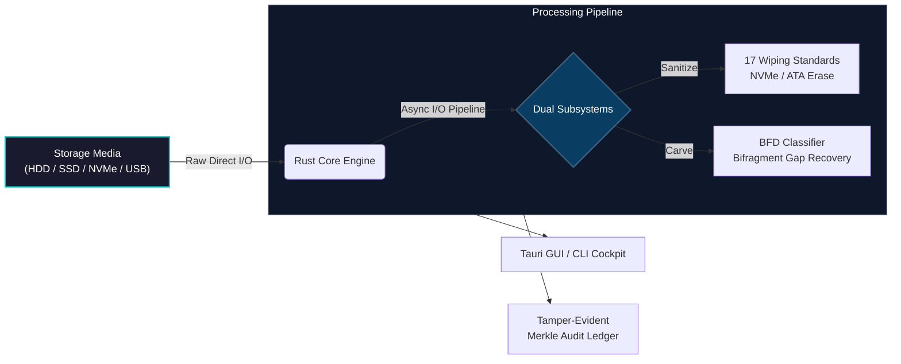
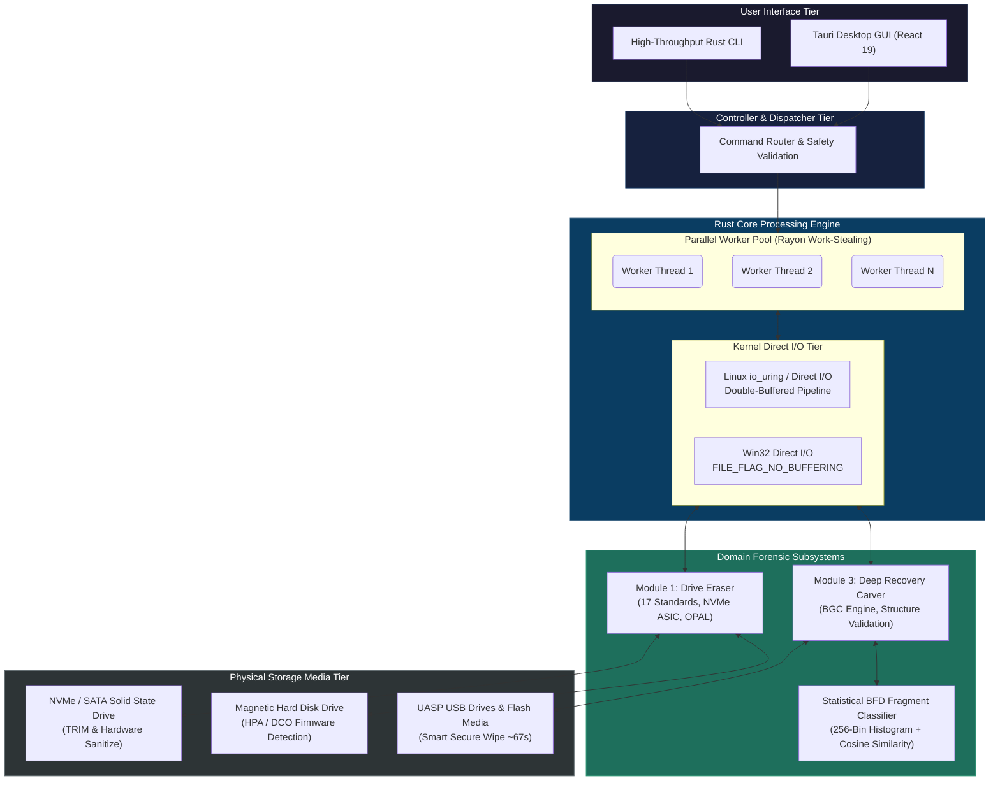

# System Architecture — PS-26149

This document outlines the high-level and detailed architecture of the Void Vault platform, reflecting low-level kernel optimizations (`io_uring`, double-buffering) and forensic techniques (BFD histograms, NVMe Sanitize) from our research.

---

## 1. High-Level Architecture Overview

---

## 2. Detailed System Architecture

---

## 3. Component Interactions & Data Flow

1. **User Request Dispatch:** Operator initiates an operation via the Tauri desktop UI or CLI. The command passes through `CoreRouter` which verifies device state and enforces the **Host Boot Drive Safety Lock**.
2. **Asynchronous Parallel Processing:** Destructive write passes or parallel read sweeps are dispatched across the **Rayon work-stealing threadpool** with **24MB double-buffered Crossbeam channels**.
3. **Hardware-Direct I/O:** Commands interface directly with physical storage via unbuffered Win32 system APIs (`FILE_FLAG_NO_BUFFERING` and `FILE_FLAG_WRITE_THROUGH`) or Linux `io_uring`, completely bypassing the operating system file cache.
4. **Closed-Loop Verification:** Following sanitization, the engine triggers Module 3 to scan the wiped space. A **BSA 2023 Section 63 certificate** is generated and committed to the append-only SHA-256 Merkle audit chain.
