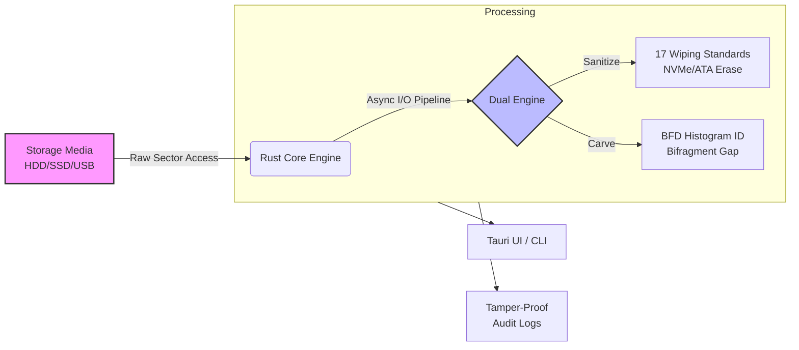

# System Architecture - PS-26149

This document outlines the high-level and detailed architecture of the SecureDrive platform, reflecting the latest performance optimizations (`io_uring`, double-buffering) and forensic techniques (BFD histograms, NVMe Sanitize) from our deep research.

## 1. PPT-Ready Architecture (Short & Crisp)



## 2. Detailed System Architecture

```mermaid
flowchart TD
    subgraph UI Layer
        Tauri[Tauri GUI - React/TS]
        CLI[Rust CLI Interface]
    end

    subgraph Controller & Dispatcher
        CoreRouter[Command Router & Validation]
        Tauri --> CoreRouter
        CLI --> CoreRouter
    end

    subgraph Rust Core Engine
        subgraph Worker Pool [Parallel Rayon/Crossbeam Workers]
            direction TB
            W1(Thread 1)
            W2(Thread 2)
            W3(Thread n)
        end
        
        subgraph Fast I/O Layer
            io_uring[Linux io_uring / Direct I/O<br/>Double-Buffered Pipeline]
            WinAPI[Windows Win32 NO_BUFFERING<br/>Overlapped I/O]
        end

        CoreRouter --> Worker Pool
        Worker Pool <--> Fast I/O Layer
    end

    subgraph Domain Engines
        Erasure[Secure Erasure Engine<br/>DoD, NIST 800-88]
        Recovery[Deep Recovery Engine<br/>BGC, Structure Validation]
        BFD[Statistical BFD Fragment Classifier<br/>256-bin histogram + cosine similarity, no ML/ONNX]
        
        Fast I/O Layer <--> Erasure
        Fast I/O Layer <--> Recovery
        Recovery <--> BFD
    end

    subgraph Hardware Layer
        SSD[NVMe / SATA SSD<br/>TRIM & Sanitize]
        HDD[Magnetic HDD<br/>HPA/DCO Unlocked]
        USB[UASP USB Drives<br/>Queue Depth > 1]
        
        Erasure <--> SSD
        Erasure <--> HDD
        Recovery <--> USB
    end
    
    style UI Layer fill:#1a1a2e,color:#fff,stroke:#16213e
    style Rust Core Engine fill:#0a3d62,color:#fff,stroke:#3c6382
    style Domain Engines fill:#1e6f5c,color:#fff,stroke:#289672
    style Hardware Layer fill:#2d3436,color:#fff,stroke:#636e72
```
