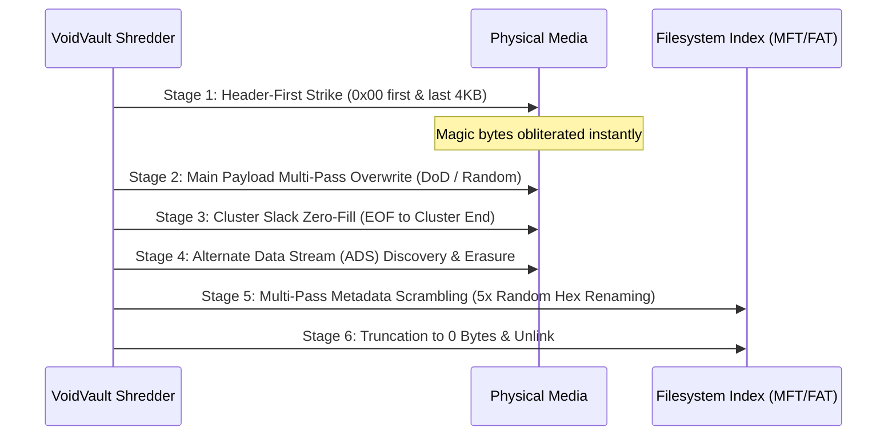

# Module 2: Anti-Forensic File Shredder Engine
## Surgical File Destruction, Alternate Data Streams & Slack Space Neutralization

---

## 1. Overview & Threat Model
Standard file deletion (`rm` or Windows Recycle Bin) merely marks directory records or inode pointers as unallocated. The file payload remains 100% intact on disk until overwritten.

Even naive shredding tools (overwriting file contents) leave massive forensic evidence behind:
1. **File Signatures:** Carving engines can still find file headers if sectors are partially flushed.
2. **NTFS Alternate Data Streams (ADS):** Hidden secondary data streams (e.g. `Zone.Identifier`) remain accessible.
3. **Cluster Slack Space:** The unused bytes between the logical End-of-File (EOF) and the end of the physical allocation cluster contain residual historical data.
4. **Filesystem Metadata & Directory Indexes:** MFT record numbers, file names, timestamps, and permissions persist in filesystem logs.

Module 2 (`ps149::file_eraser`) implements **VSSP-26 (VoidVault Surgical Sanitization Protocol)** to neutralize all forensic traces.

---

## 2. The 6-Stage VSSP-26 Shredding Pipeline



### Stage 1: Header-First Surgical Strike
Before writing multi-pass patterns across gigabytes of data, the shredder immediately zeroes out:
*   The first **4,096 bytes** of the file (wiping magic headers like `FF D8 FF`, `89 50 4E 47`, `%PDF-`).
*   The last **4,096 bytes** of the file (wiping footers like `%%EOF`, `FF D9`, `PK\x05\x06`).
*   *Forensic Impact:* If the shredding process is interrupted or unplugged, deep carvers (Disk Drill, PhotoRec) can no longer detect or reconstruct the file.

### Stage 2: Multi-Pass Direct Overwrite
*   Uses unbuffered direct I/O (`FILE_FLAG_NO_BUFFERING`).
*   Passes: DoD 5220.22-M 3-pass or NIST Clear pseudorandom pass.
*   Flushes file buffers to hardware with `FlushFileBuffers` / `fdatasync`.

### Stage 3: Cluster Slack Space Neutralization
*   Hard drives and SSDs allocate storage in fixed cluster units (typically 4,096 bytes).
*   If a file has a logical size of 5,000 bytes, it occupies two 4,096-byte clusters (8,192 bytes total).
*   The **3,192 bytes** of slack space between offset 5,000 and 8,192 retain historical bytes from previously deleted files.
*   VoidVault calculates the physical cluster boundary and overwrites the exact slack space with zeroes.

### Stage 4: Alternate Data Stream (ADS) Wipe
*   On NTFS, files can have hidden streams (e.g. `evidence.pdf:hidden_stream` or `evidence.pdf:Zone.Identifier`).
*   VoidVault enumerates all streams using `FindFirstStreamW` / `FindNextStreamW`.
*   Every secondary stream is individually overwritten with cryptographic randomness and truncated before the main file handle is closed.

### Stage 5: Metadata Renaming Scramble
*   Filesystems record file names in MFT records or FAT directory entries.
*   VoidVault performs a **5-pass renaming cascade** before deletion:
    ```
    confidential_report.pdf
      -> 7f9a1b8c2d.tmp
      -> a3e8f1c0d4.tmp
      -> 99c7b2a510.tmp
      -> 0000000000.tmp
      -> zzzzzzzzzz.tmp
    ```
*   *Forensic Impact:* Forensic timeline analysis cannot recover the original document name.

### Stage 6: Truncation & Unlink
*   File length is truncated to `0` bytes (`SetEndOfFile` / `ftruncate`).
*   Timestamps are randomized to an arbitrary epoch (e.g., 1980-01-01).
*   The filesystem entry is unlinked.
