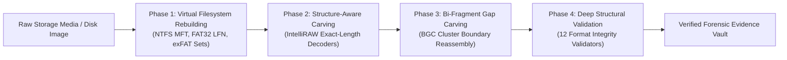

# Module 3: Deep File Carver & Reconstruction Engine
## Dual-Mode Recovery: Filesystem Virtual Rebuilding & Structure-Aware IntelliRAW Carving

---

## 1. Overview & Forensic Mission
Module 3 (`ps149::carver`) serves as VoidVault's offensive forensic recovery engine. Designed to fulfill the dual-use requirement of **NTRO Problem Statement 26149**, it reconstructs deleted, fragmented, or formatted digital evidence from raw storage media (`\\.\PhysicalDriveX`, volume handles `\\.\D:`, or raw forensic disk images `.dd`/`.raw`).

It rivals commercial forensic tools (**Disk Drill, R-Studio, DMDE, GetDataBack, PhotoRec, Magnet AXIOM**) by implementing a multi-phase, structure-aware pipeline:

---

## 2. Phase 1: Virtual Filesystem Metadata Rebuilding

Unlike naive carvers that ignore filesystem metadata and produce generic names like `file_0001.jpg`, VoidVault recovers files with **original filenames, directory folder structures, exact byte lengths, and ISO-8601 timestamps**.

### 2.1 exFAT Forensic Stream Parser (`exfat_dir.rs`)
*   **The exFAT Architecture:** Used on almost all modern USB flash drives, SDXC cards, and external drives larger than 32 GB.
*   **Deletion Marker:** When Windows deletes a file on exFAT, it sets bit 7 of the entry types to `0`:
    *   `0x85` (File Directory Entry) $\rightarrow$ `0x05`
    *   `0xC0` (Stream Extension Entry) $\rightarrow$ `0x40`
    *   `0xC1` (File Name Entry) $\rightarrow$ `0x41`
*   **Stream Reconstruction:**
    *   Reads the Volume Boot Record (VBR) at sector 0 to determine cluster heap offset, sector shift, and cluster shift.
    *   Parses the 32-byte directory entry sets.
    *   Extracts `ValidDataLength` (u64 le) for exact byte-accurate file length.
    *   Extracts `FirstCluster` (u32 le) and checks `NoFatChain` secondary flag (bit 1).
    *   Assembles UTF-16LE characters from all `0xC1` / `0x41` entries to reconstruct the full Unicode filename up to 255 characters.
    *   Converts 32-bit DOS timestamps to ISO-8601 format.

### 2.2 NTFS Master File Table ($MFT) Parser (`ntfs_mft.rs`)
*   Parses 1,024-byte `FILE` records.
*   Recovers deleted entries marked with in-use flag `0x00`.
*   Handles resident data streams (`$DATA` $\le 700$ bytes stored directly inside the MFT record).
*   Decodes non-resident compressed data runs (cluster offset + run length) to stream non-contiguous cluster allocations.
*   Extracts original file creation and modification timestamps from `$STANDARD_INFORMATION`.

### 2.3 FAT32 Long File Name (LFN) Engine (`fat_dir.rs`)
*   Scans directory clusters for `0xE5` deleted markers.
*   Chains together preceding `ATTR_LFN` (`0x0F`) records in reverse sequence order to reconstruct original case-sensitive filenames.

---

## 3. Phase 2: Structure-Aware Carving (IntelliRAW Style)

When filesystem metadata has been completely wiped or overwritten, VoidVault falls back to raw sector carving.

### The "Dumb Carver" Failure Mode
A naive carver searches for a magic header (e.g. `RIFF`), reads until `max_size` (e.g. 2 GB for audio, 4 GB for video), and outputs a multi-gigabyte file containing zeroes or subsequent files, corrupting evidence and jumping past other deleted items.

### VoidVault's Smart Exact-Length Decoders (`smart_length.rs`)
VoidVault inspects internal container headers to extract the exact byte boundary:
*   **BMP:** Reads bytes 2..6 (`u32::from_le_bytes`).
*   **RIFF (WAV, AVI, WebP):** Reads bytes 4..8 (`u32::from_le_bytes + 8`).
*   **PNG:** Iterates chunk headers (`length + type + data + CRC`) until the `IEND` chunk (+ 4 bytes).
*   **MP4 / MOV:** Walks ISO Base Media File Format top-level atoms (`ftyp`, `moov`, `mdat`, `free`, `skip`).
*   **SQLite Databases:** Reads page size (bytes 16..18) and database page count (bytes 28..32) to compute `page_size * page_count`.
*   **ZIP / DOCX / XLSX:** Scans backwards for the End of Central Directory (EOCD: `50 4B 05 06`) and extracts central directory offset and size.
*   **PCAP Network Captures:** Walks 16-byte packet headers (`ts_sec`, `ts_usec`, `incl_len`, `orig_len`).
*   **EVTX Windows Event Logs:** Reads 4,096-byte header and counts 64KB `ElfChnk\0` chunks.
*   **Windows PE (EXE / DLL):** Parses section table raw data pointers and sizes.

---

## 4. Phase 3: Bi-Fragment Gap Carving (BGC Engine)

Implements **Simson Garfinkel's Bi-Fragment Gap Carving (BGC)** algorithm (`fragment.rs`):
1. **Candidate Header & Footer Discovery:** Locates header $H$ and candidate footer $F$.
2. **Contiguity Check:** If the contiguous slice fails structural validation, the algorithm initiates gap analysis.
3. **Cluster-Aligned Split Points:** Tests candidate split points aligned to physical allocation cluster boundaries ($512, 1024, 2048, 4096, 8192, 16384, 32768, 65536$).
4. **Null Gap Detection:** Automatically detects runs of zeroes (unallocated gaps) separating data clusters.
5. **Shannon Entropy Symmetry:** Computes entropy for candidate fragments ($H_1$ and $H_2$), verifying that compressed media maintains uniform distribution ($|H_1 - H_2| < 0.5$).
6. **Reassembly & Validation:** Stitches fragment 1 and fragment 2 into candidate buffer and executes format validation.

---

## 5. Phase 4: Deep Structural Validation (`validators.rs`)

Eliminates false positives by validating internal codec syntax:
*   **JPEG:** Validates SOI (`FF D8`), SOF marker (frame dimensions and color channels), DHT (Huffman tables), DQT (quantization tables), SOS (`FF DA`), and EOI (`FF D9`).
*   **PNG:** Validates 8-byte signature, `IHDR` width/height/color type, and `IEND` chunk.
*   **PDF:** Verifies header `%PDF-`, cross-reference table (`xref`), trailer dictionary, and terminal `%%EOF`.
*   **ZIP / Office:** Validates `PK\x03\x04` local file headers and matching `PK\x05\x06` EOCD record.
*   **SQLite:** Verifies `"SQLite format 3\0"` header and power-of-two page size between 512 and 65,536.
*   **Windows EVTX:** Verifies `"ElfFile\0"` header and major version.
*   **PCAP:** Validates packet header timestamps and length bounds.
