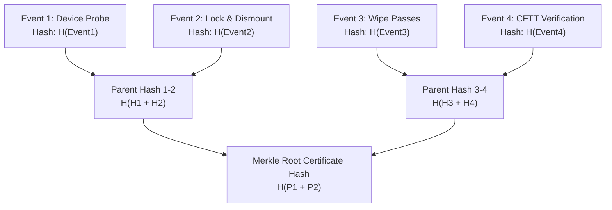

# Module 5: Forensic Audit Ledger & Cryptographic Certificates
## Tamper-Evident Chain of Custody, Merkle DAG & ISO 27001 / NIST Certificates

---

## 1. Overview & Chain of Custody Mandate
In national defense, law enforcement, and regulated enterprise environments (GDPR, HIPAA, DoD, NTRO), sanitization records must be legally admissible in judicial proceedings and regulatory audits.

Module 5 (`ps149::report` & `ps149::forensic`) produces cryptographically verifiable, tamper-evident Sanitization Certificates and logs all operational events into an immutable **Merkle Directed Acyclic Graph (DAG)** ledger.

---

## 2. Cryptographic Certificate Architecture

Each sanitization certificate is generated with non-repudiation guarantees:
1. **Device Fingerprint:**
   - Physical Drive Model, Serial Number, Firmware Revision, Bus Interface (NVMe/SATA/USB).
   - WWN (World Wide Name) / SCSI EUI-64 unique identifier.
   - Total LBA sector count and physical capacity in bytes.
2. **Execution Metadata:**
   - Sanitization Standard Applied (e.g. NIST SP 800-88 Rev 1 Clear / DoD 5220.22-M).
   - Total passes completed, pattern sequence, and execution duration.
   - Start and completion timestamps (ISO-8601 UTC).
   - Operator credentials and machine host ID.
3. **Verification Results:**
   - Independent verification pass result (Pass / Fail).
   - Number of sampled sectors vs. 100% full surface sweep.
   - Pre-wipe SHA-256 / SHA-3 hash vs. Post-wipe hash.
   - Shannon entropy distribution metrics ($H_{avg} = 0.0000$).
4. **Digital Signature:**
   - Cryptographic hash over the entire JSON-LD canonicalized schema.

---

## 3. Merkle DAG Audit Ledger

To prevent post-hoc tampering or certificate forgery, all operational events are chained into a local append-only Merkle ledger:

*   **Immutability:** Modifying any single byte of a historical event breaks the entire Merkle root hash.
*   **Verification:** Auditors can independently verify the authenticity of a certificate using only the Merkle proof path without needing the raw disk dump.

---

## 4. Export Formats
*   **JSON-LD:** Machine-readable Linked Data schema for automated enterprise compliance pipelines and SIEM ingestion.
*   **Forensic PDF Report:** Human-readable, publication-grade certificate complete with hardware details, audit timestamps, entropy graphs, and QR codes linking to verification hashes.
