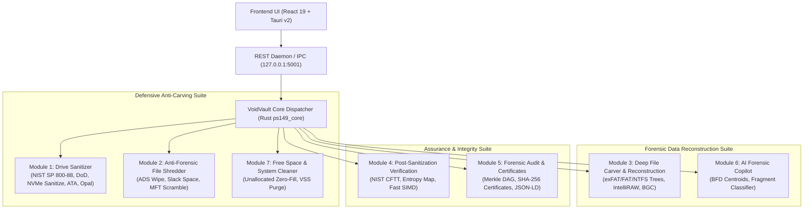

# VoidVault (PS-26149) — Module Architecture & Documentation Suite
## Complete Low-Level Documentation for SIH 2026 / NTRO Forensic Suite

---

## 🏛️ Architecture Overview

VoidVault is engineered as a complete forensic security ecosystem fulfilling **NTRO Problem Statement 26149**:
It provides **military-grade drive sanitization (anti-carving defense)** and **cutting-edge deep data reconstruction (forensic recovery offense)**.

---

## 📚 Module Documentation Index

| Module | Document | Description | Key Standards / Technologies |
| :--- | :--- | :--- | :--- |
| **Module 1** | [Drive Sanitizer](./MODULE_1_DRIVE_SANITIZER.md) | Physical drive sanitization engine | NIST SP 800-88 Rev 1, DoD 5220.22-M, NVMe Sanitize, ATA Secure Erase, TCG Opal 2.0 |
| **Module 2** | [File Shredder](./MODULE_2_FILE_SHREDDER.md) | Surgical anti-forensic file deletion | Header-First Strike, ADS Streams, Slack Space Zeroing, MFT Renaming Scramble |
| **Module 3** | [Deep Carver & Reconstruction](./MODULE_3_DEEP_CARVER_AND_RECONSTRUCTION.md) | Commercial-grade forensic recovery | Virtual Filesystem Reconstruction (exFAT/FAT32/NTFS), IntelliRAW Smart Lengths, BGC |
| **Module 4** | [Verification & CFTT](./MODULE_4_VERIFICATION_AND_CFTT.md) | Independent erasure verification | NIST CFTT Suite, Shannon Entropy Mapping, SIMD Fast Zero Check |
| **Module 5** | [Audit & Certificates](./MODULE_5_AUDIT_AND_CERTIFICATE.md) | Forensic reporting & compliance | Merkle DAG Audit Chain, SHA-256 Tamper-Proof Certificates, JSON-LD |
| **Module 6** | [AI Forensic Copilot](./MODULE_6_AI_FORENSIC_COPILOT.md) | AI-driven forensic intelligence | Byte Frequency Distribution (BFD), Shannon Entropy Profiler, Drive Advisor |
| **Module 7** | [Free Space & System Cleaner](./MODULE_7_FREE_SPACE_AND_SYSTEM_CLEANER.md) | System & unallocated space cleaner | Unallocated Sector Flood, Volume Shadow Copy (VSS) Purge, USN Journal Cleaner |

---

## 🔒 Security & Concurrency Design Principles
1. **Memory Safety:** 100% written in Rust (2021/2024 edition) with strict zero-cost abstractions and compile-time concurrency safety.
2. **Direct Kernel I/O:** Uses OS-native unbuffered flags (`FILE_FLAG_NO_BUFFERING` and `FILE_FLAG_WRITE_THROUGH` on Windows, `O_DIRECT` and `io_uring` on Linux) to bypass OS file caching entirely.
3. **Hardware Interlocks:** Dual-layer physical disk verification prevents accidental erasure of the host OS drive (Disk 0).
